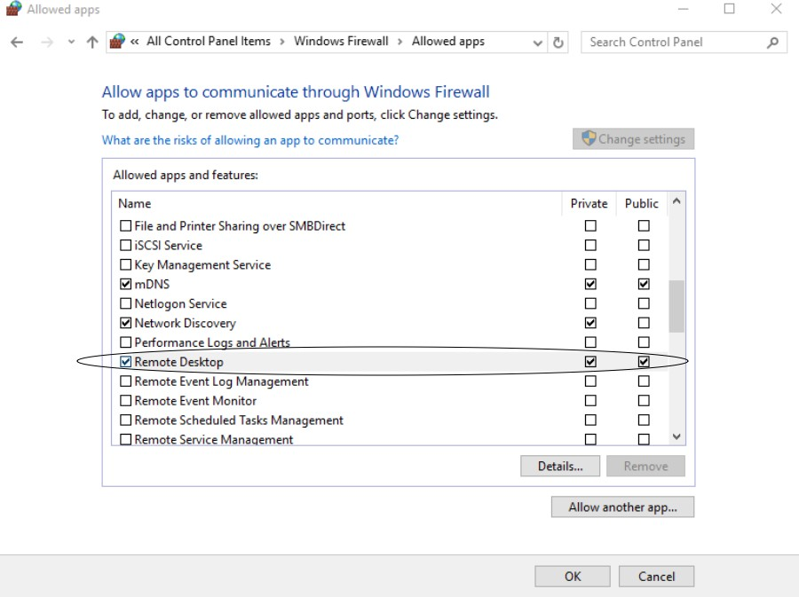
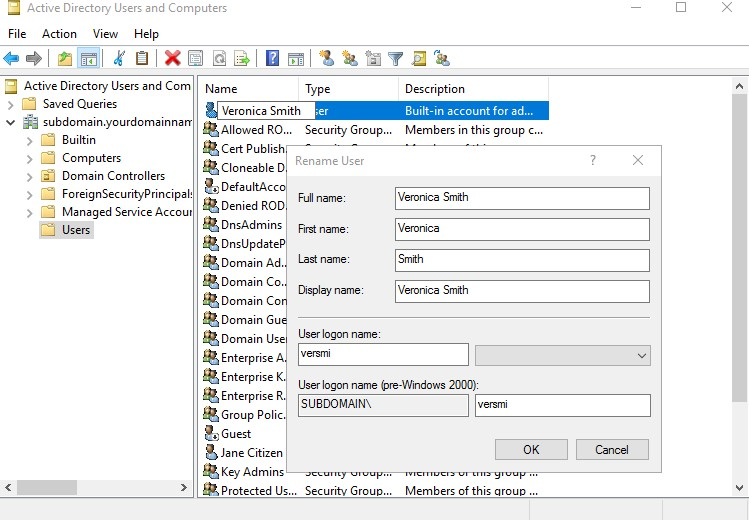

Windows Server 2016 Install és Adminisztrációs segédlet

# Section 1: Installing Windows 2016 Server Software

### Telepítés megkezdése előtt érdemes tanulmányozni

>   Windows Server 2016

>   <https://docs.microsoft.com/en-us/windows-server/windows-server-2016>

>   System Requirements for Windows 2016 Server

>   <https://docs.microsoft.com/en-us/windows-server/get-started/system-requirements>

>   Important Issues in Windows Server 2016

>   <https://docs.microsoft.com/en-us/windows-server/get-started/windows-server-2016-ga-release-notes>

### Legjobb gyakorlatok (Best Practicies)

-   Soha ne telepítsünk új rendszert a nyilvános hálózatra.

-   Először indítsuk el a rendszert egy fejlesztői/teszt környezetben, majd
    utána helyezzük át az éles környezetbe.

-   A patch-eket azonnal installáljuk a telelpítést követően

-   Alkalmazzuk a biztonsági beállításokat a rendszerre.

-   Tűzfal konfigurálása.

-   Telepítsük és frissítsük a víruskereső szoftvert.

-   Ellenőrizzük az összes beállítást.

-   A rendszer frissítések előtt készítsünk teljes biztonsági másolatot!

1. Kapcsolja be a rendszert, és helyezze be a telepítőlemezt

a. Ha a BIOS indítási sorrendje nincs beállítva a CD / DVD meghajtóról történő
indításra, akkor a telepítés megkezdése előtt módosítani kell ezeket a
beállításokat

2. Válasszuk ki a Nyelv, Idő és pénznem formátumot, valamint a Billentyűzet
beviteli módot.

3. Kattintsumk a Tovább gombra.

| [media/de45f1a5a3643cdea8893e6078ee3831.png](media/de45f1a5a3643cdea8893e6078ee3831.png) Server%202016%20Screenshots/A%20Install/A%20Server%202016%20Install%20iso%202%20Main.png 4. Kattintsunk az Install now-ra | [media/82fa9a4476fe8a4f90f6a259489b398c.jpeg](media/82fa9a4476fe8a4f90f6a259489b398c.jpeg) a. Ezt az üzenetet fogjátok látni “Setup is starting”. |
|--------------------------------------------------------------------------------------------------------------------------------------------------------------------------------------------------------------------|---------------------------------------------------------------------------------------------------------------------------------------------------|
| [media/1cc216216dc8627b71b5b059c5257971.png](media/1cc216216dc8627b71b5b059c5257971.png)                                                                                                                           | [media/65f97c7fd82d96a910547966a56b919c.png](media/65f97c7fd82d96a910547966a56b919c.png)                                                          |

b. Az iso telepítés a számítógép javításához is használható.

Ha a fenti Windows telepítő képernyőn a Számítógép javítása lehetőséget
választjuk, akkor a rendszer megkéri, hogy végezzük el a számítógép
hibakeresését (Troubleshoot) vagy kikapcsolását (Turn off your PC)

>   ii. Ha a Hibaelhárítás (Troubleshoot) lehetőséget választjuk, vagy kereshet
>   egy System Image fájlt a Windows helyreállításához, vagy elindíthat egy
>   Parancssorot (Command Prompt).

iii. A témában érdemes átnézni az alábbi dokumentációkat:

<https://technet.microsoft.com/library/cc755163.aspx>

>   Wbadmin Start sysrecovery:
>   [https://technet.microsoft.com/en-](https://technet.microsoft.com/en-us/library/cc742118(v%3Dws.11).aspx)
>   [us/library/cc742118(v=ws.11).aspx](https://technet.microsoft.com/en-us/library/cc742118(v%3Dws.11).aspx)

5. Válasszuk ki a telepíteni kívánt operációs rendszert.

>   a. Az alapértelmezett beállítás a Windows Server 2016 Standard. Ez a Server
>   Core Edition, amelyet a parancssoron,Powershell-en vagy a távolról
>   kezelhető. A Server Core a Microsoft által ajánlott opció.

b. A Windows Server 2016 Standard (Desktop Experience) a grafikus felülettel
töltődik be.

>   c. Ha egyik operációs rendszer opcióról szeretne váltani a másikra, akkor
>   azt csak úgy tehetjük . Teljes újratelepítést kell végrehajtania.

6. Kattintsunk a Next-re

>   Server%202016%20Screenshots/A%20Install/A%20Server%202016%20Install%20iso%204b.png

7. Olvassuk el a licencfeltételeket.

a. Telepítés előtt olvassa el és fogadja el a licencelési feltételeket.

b. Csak akkor folytatható a telepítést, ha a licencfeltételek elfogadásra
kerülnek.

8. Kattintsunk a Tovább gombra

9. Válasszuk ki, hogy milyen típusú telepítést szeretnénk?

a. Frissítés

Ez az opció akkor használható, amikor frissítjük a Windowst egy előző
verziójáról.

ii. Minden fájl, beállítás és program sértetlen marad.

b. Egyedi

Ez az opció a Windows új példányának telepítésére szolgál

ii. Törli a meghajtó és minden rajta lévő adatot!

10. Válasszuk új telepítés, kattintsunk a Custom: Install Windows only
(advanced)

11. Hova szeretnénk telepíteni a Windows rendszerünket?

a. Válasszuk ki a Windows telepítéséhez használni kívánt meghajtót.

b. Ha a merevlemezt nem találja, akkor be kell töltenie a megfelelő
illesztőprogramokat.

Kattintson az Illesztőprogram betöltésére (Load driver)

ii. Az illesztőprogram ezután CD, DVD vagy USB meghajtóról tölthető be.

>   iii. Az illesztőprogram betöltése után a merevlemez opcióként szerepel a
>   telepítővarázslóban.

c. További opciók: Törlés, Új, Kiterjesztés, Formátum (Delete, New, Extend,
Format)

Ha töröljük az aktuális partíciót:

ii. Hozzunk létre egy új partíciót

>   iii. Terjesszük (Extend) ki a partíciót, amely lehetővé teszi a partíció
>   nagyobbá tételét. Ez a művelet nem vonható vissza!

iv. Formázzuk a partíciót

d. Ha ez egy új lemez, akkor semmilyen más műveletet nem kell végrehajtani. A
következő gombra kattintva automatikusan létrehoz egy partíciót a teljes lemez
felhasználásával, formázza és elindítja a telepítést.

12. Kattintson a Tovább gombra.

13. A Windows installálása folyamatban

14. A Windows a telepítést követően újraindul

15. A Windows frissít és újraindul

16. Adjuk meg a rendszergazdai fiók jelszavát.

17. Győződjünk meg arról, hogy a jelszó választásnál betartjuk-e a szervezetünk
jelszóra vonatkozó irányelveket.

a. Elkerülendő a rendszer feltöröését a jelszónak 18-20 karakter hosszúnak kell
lennie.

>   b. A Microsoft további információ itt található:
>   <https://www.microsoft.com/en-us/research/wp-content/uploads/2016/06/Microsoft_Password_Guidance-1.pdf>

18. Kattintsunk a Befejezés (Finish) gombra.

19. A jelszó be lett állítva.

# Section 2: Windows Server 2016 Initialization

1.  Jelentkezzünk be a rendszergazda fiókba a telepítés során létrehozott
    jelszóval.

1.  Először megjelenik egy üzenet, amely megkérdezi, hogy engedélyezi-e a
    hálózati felfedezhetőséget (Network discovery)

    1.  Ez lehetővé teszi, hogy az engedélyezett számítógépet a hálózat többi
        számítógépe is láthassa.

1.  Ha az Igen gombra kattint, akkor a Windows tűzfalban engedélyezi a Hálózati
    felfedezés (Network Discovery) alkalmazást csak a privát hálózathoz. Ez a
    beállítás a Vezérlőpult\> Windows tűzfal\> Alkalmazások vagy szolgáltatások
    engedélyezése a Windows tűzfalon (Control Panel \> Windows Firewall \> Allow
    an app or feature through Windows Firewall) keresztül érhető el.

1.  Ha a Nem gombra kattintunk, vagy elmulasztja a párbeszédet ablakot, akkor ez
    az opció újrakonfigurálható.

    1.  Válassza a Vezérlőpult\> Hálózati és megosztási központ menüpontot
        (Control Panel \> Network and Sharing Center). A bal oldali
        menüopciókban kattintson a Speciális megosztási beállítások (Change
        advanced sharing) módosítása elemre.

        1.  Testreszabható privát, vendég vagy nyilvános, valamint minden
            hálózat számára (Private, Guest, Public és All Networks)

        2.  Előfordulhat, hogy vissza kell térnünk a Windows tűzfalra, és
            engedélyeznie kell a Hálózati felderítést, amint azt az előző
            utasítás jelzi.

1.  Értesítéseket küld a rendszer a tálcán látható módon (is).

1.  Ez egy Action Center értesítés a Windows SmartScreen bekapcsolásáról.

    a. A Windows-ban SmartScreen alapértelmezés szerint le van tiltva, és a
    csoportházirenden keresztül egy tartományi rendszergazdai fiókkal
    engedélyezhető.

    b. A Windows SmartScreen az Internet Explorer és a Microsoft Edge
    böngészőkkel működik, összehasonlítva a meglátogatott webhelyek URL-jét a
    szűrővel integrált nagy forgalmú webhelyek listájával. Ha a webhely nem
    egyezik a listával, a SmartScreen szűrők lekérdezést küld a megfelelő
    URL-hírnevszolgáltatáshoz (Reputation Service). Ha az URL-t nem
    biztonságosnak minősíti,akkor a szűrő üzenetet jelenít meg a felhasználó
    számára, hogy figyelmeztesse őt a személyes adatok bevitelére vagy tartalom
    letöltésének veszéleyeira az webhelyről.

    c. A telemetria a webhelyre vonatkozó további információk jelentésére
    szolgál.

    d. A szoftverek használatához IPv4-kapcsolat szükséges.

    Bővebben a SmartScreen-ről:
    <https://docs.microsoft.com/en-us/previous-versions/windows/it-pro/windows-server-2012-R2-and-2012/jj618329(v=ws.11)?redirectedfrom=MSDN#BKMK_How>

    A SmartScreen Windows 10-es operációs rendszeren is elérhető:

    <https://www.youtube.com/watch?v=15a2qUM_EpY>

>   Amíg nem aktiválja a Windows Server operációs rendszerét,addig ez az üzenet
>   fog megjelenni az asztal jobb alsó sarkában.

# Section 3: Welcome to Server Manager

A Kiszolgálókezelő irányítópultján (Server Manager Dashboard) egy pillanat alatt
megtaláljuk a szerverre telepített összes szerepkört, és értesítéseket fogunk
kapni minden hibáról vagy poblémáról. A hiperlink opció az egyes menük gyors
indítási lehetőségeit kínálja.

A Server 2016-nál régebbi operációs rendszereket futtató kiszolgálók kezeléséhez
telepítenie kell a következő szoftvereket és frissítéseket a távoli
kiszolgáló(k)ra:

[https://docs.microsoft.com/en-us/windows-server/administration/server-](https://docs.microsoft.com/en-us/windows-server/administration/server-manager/server-manager)
[manager/server-manager](https://docs.microsoft.com/en-us/windows-server/administration/server-manager/server-manager)

1.  Kattintson a (1) A helyi kiszolgáló (Local Server) konfigurálása
    megtekintésre a Szerver tulajdonságainak szerkesztéséhez, vagy kattintson a
    Helyi kiszolgáló elemre a bal oldali menü ablaktáblán. A konfigurációs
    lehetőségek a következők:

    1.  Számítógép neve (Computer Name)

    2.  Munkacsoport / Tartomány (Workgroup/Domain)

    3.  Windows tűzfal (Windows Firewall)

    4.  Távoli elérési lehetőség (Remote Access Option)

    5.  Konfigurálja a Windows frissítéseket (Configure Windows Updates)

    6.  Állítsa be az idő / időzónát (Set the time/time zone)

    7.  Lásd az operációs rendszer és a hardver részleteit (See operating
        systems and hardware details)

    8.  Események megtekintése (View Events)

2.  Hozzáférési szolgáltatások (Access Services)

    1.  Futtassa a legjobb gyakorlatok elemzőjét (Run the Best Practices
        Analyzer)

    2.  A teljesítmény részleteinek megtekintése (View Performance details)

    3.  Szerepek és szolgáltatások megtekintése és szerkesztése (View and Edit
        Roles and Features)

3.  Szerepek és szolgáltatások hozzáadása (Add roles and features), elindítja a
    varázslót szerepkörök vagy szolgáltatások hozzáadásához vagy
    eltávolításához.

GYAKROLAT

1.  Adjunk hozzá további kiszolgálókat a kezeléshez (legfeljebb 100, a
    kiszolgáló rendelkezésére álló hardver- és hálózati erőforrásoktól függően),
    adjunk hozzá tartomány- és munkacsoport-kiszolgálókat a három módszer
    egyikével (lásd:
    [https://docs.microsoft.com/en-us/windows-server/administration/server-manager/add-servers-to-server-](https://docs.microsoft.com/en-us/windows-server/administration/server-manager/add-servers-to-server-manager)
    [manager](https://docs.microsoft.com/en-us/windows-server/administration/server-manager/add-servers-to-server-manager)):

    a. Active Directory

    b. DNS

    c. Importálás

2.  Hozzunk létre egy kiszolgálócsoportot, amely lehetővé teszi a rendszerek
    logikai csoportosítását, figyelemmel kísérését és kezelését. Például egy
    adatbázis-kiszolgálók csoportja (Group of Databse Servers), egy IIS-csoport
    (IIS Group) vagy egy fájlszerverek csoportja és így tovább.

3.  Csatlakoztassa ezt a kiszolgálót a felhőszolgáltatásokhoz, elindít egy
    böngészőt a webhely betöltéséhez,
    <https://www.microsoft.com/en-us/cloud-platform/operations-management-suite>.

További hasznos információk:

Add roles and features Windows Server 2016:
<https://www.youtube.com/watch?v=De4NH7OYXc8>

Install Server Manager on Windows 10:
<https://www.youtube.com/watch?v=TuRzRgdaZRk>

Server Manager:
<https://docs.microsoft.com/en-us/windows-server/administration/server-manager/server-manager>

### SERVER MANAGER HASZNÁLATA

### A Server Manager megfelelő használata a szerver hatékony kezelésének egyik kulcsa

#### [media/9a7894181ecfcbf141911d97eefec981.jpeg](media/9a7894181ecfcbf141911d97eefec981.jpeg)

~   Server%202016%20Screenshots/C%20Menu/C%20Server%202016%20Menu%201.png

Server Manager Console Header:

A Kiszolgálókezelő tetején balra nyilakat és navigációs lehetőségeket találunk.
A jobb oldalon található egy Frissítés gomb, a befejezett vagy függőben lévő
feladatok értesítési jelzője és egyéb menüopciók, amelyekkel gyorsan kezelhetjük
szerverünket, elérhetjük az eszközöket, megváltoztathatjuk a nézetet vagy
kereshetünk a súgó dokumentációjában.

#### [media/92d63b94f1cf0592d8a85ec57314ca5b.jpeg](media/92d63b94f1cf0592d8a85ec57314ca5b.jpeg)

~   Server%202016%20Screenshots/C%20Menu/C%20Server%202016%20Menu%202.png

The Notifications Area:

A zászló ikon jelzi az Értesítések területet, és megjeleníti a folyamatban lévő,
függőben lévő vagy további műveleteket igénylő feladat részleteit. Az ikon
mellett egy szám jelzi, hogy függőben lévő üzenetek vannak.

Ha megjelenik egy figyelmeztető háromszög, ez azt jelenti, hogy vannak függőben
lévő feladatok, amelyek azonnali figyelmet igényelnek.

A zászlóra kattintva megjelenik a függőben lévő esemény előrehaladása, valamint
egy link további információkra. A függőben lévő feladatok elvégzéséhez egy link
irányít minket a következő lépésre.

#### [media/1e7577fd8feec366ee8973e441b50a67.png](media/1e7577fd8feec366ee8973e441b50a67.png)

~   Server%202016%20Screenshots/C%20Menu/C%20Server%202016%20Menu%205.png

Manage:

>   A Manage menü a következő lehetőségeket kínálja:

>   1. Add Roles and Features

>   2. Remove Roles and Features o

>   3. Add Servers

>   4. Create Server Group

>   5. Server manager Properties

>   Alap beállítás

#### Tools:

>   Default Available Tools:

>   Server%202016%20Screenshots/C%20Menu/C%20Server%202016%20Menu%207.png

A Tools menü közvetlen hozzáférést biztosít az Felügyeleti eszközök
(Administrative Tools) parancsokhoz. Ez a leggyorsabb módszer a felügyeleti
eszközök elérésére. Amint további szerepköröket és szolgáltatásokat telepítünk a
szerverre, ebben a menüben további parancsikonok jelennek meg. Az Eszközök menü
szintén testreszabható. Ennek kezelési lehetőségeiről itt lehet bővebben
tájékozódni:

<https://docs.microsoft.com/en-us/windows-server/administration/server-manager/manage-the-local-server-and-the-server-manager-console>

#### [media/e0cca3ad57980f47a2fb249e0055ded4.jpeg](media/e0cca3ad57980f47a2fb249e0055ded4.jpeg)

~   Server%202016%20Screenshots/C%20Menu/C%20Server%202016%20Menu%208.png

View:

Az alapértelmezett Server Manager nézet 100% -ra van állítva. A View menüben
lehetmódosítani nagyítását.

#### [media/dcff699482209d67f48307af7b9697c0.png](media/dcff699482209d67f48307af7b9697c0.png)

~   Server%202016%20Screenshots/C%20Server%202016%20Menu%209.png

Help:

>   A Server Manager Help az alapértelmezett böngészőt ide irányítja:
>   <https://technet.microsoft.com/library/2194da26-7e64-4497-b4ee-c2d815f655c0>.

>   A Windows Server Marketplace ide mutat:
>   <https://www.windowsservercatalog.com>. Windows Server TechCenter erre az
>   oldalra irányít: <https://technet.microsoft.com/en-us/library/hh831456>.

### KÖTELEZŐ BEÁLLÍTÁSOK

#### Set the Time Zone

1.  A Server Manager irányítópultján kattintson a Local Server-re a bal oldali
    menü ablaktábláján

1.  Kattinsunk az Időzóna (Time Zone) linkre

    Kattintsunk a Change time zone-ra

>   Server%202016%20Screenshots/D%20Config/D%20Server%202016%20Config%202b.png

1.  A legördülő menüből válasszuk ki a megfelelő időzónát, majd kattintson az OK
    gombra

1.  További órákat a További órák (Additional Clocks) fülről is beállíthatunk.

>   Server%202016%20Screenshots/D%20Config/D%20Server%202016%20Config%202d.png

1.  Az alapértelmezett internetes időszerver szinkronizálva van az
    „time.windows.com” címmel. Ez az Internet Idő (Internet Time) fülről
    szerkeszthető.

    1.  Kattintsunk a Change settings-re

1.  A legördülő menüből válasszuk ki a megfelelő szervert: time.nist.gov.

    1.  Kattintsunk az Update now-ra. Ez kikényszeríti az idő frissítését a
        rendszerre, amint az internetes időszerver be van állítva

    2.  Kattinstsunk az OK-ra.

### Új hálózati kártya/kártyák beállítása

1.  A Server Manager Dashboard-onkattintsunk a Local Server elemre a bal oldali
    menüben.

    1.  Ha már csatlakoztunk a privat hálózathoz és van internet hozzáférésünk,
        akkor az IP cím megváltoztatását utoljára is tehetjük.

    2.  Ha csatlakozni szeretnénk a hálózathoz, akkor statikus IP-címet kell
        beállítanunk a folytatáshoz.

1.  Kattintsunk az Ethernet0 linkre

1.  A Network Connections ablakban nyomjunk egy jobb az Ethernet0-on és
    válasszuk a Properties menüt.

  
4. Jelöljük ki az Internet Protocol 4-es verziót (TCP / IPv4). Kattintsunk a
Tulajdonságok (Properties) elemre.

Ha a hálózat az IPv6-ra van állítva, akkor az Internet Protocol 6-os verziót
(TCP / IPv6) kell választani az Ethernet0 Tulajdonságok ablakban, és kattintani
a Tulajdonságok gombra a konfiguráláshoz.

>   5. Töltsük ki a hálózatának megfelelő IP-információkat. Írjuk be a statikus
>   IP-címet (IP address), az alhálózati maszkot (Subnet mask) és a hálózati
>   alapértelmezett átjárót (Default gateway). A tartományvezérlőjének előnyben
>   részesített DNS-kiszolgálója az adott DC lesz, és az alternatív
>   DNS-kiszolgáló egy másik DC lehet a hálózaton. Kattintsunk az OK gombra.

>   Server%202016%20Screenshots/D%20Server%202016%20Config%203b.png

>   6. Amikor befejeztük a konfigurálást, akkor kattintsunk az OK gombra.

>   Server%202016%20Screenshots/D%20Server%202016%20Config%203d.png

>   7. IP-cím hozzárendelésekor nevezzük át a hálózati kártyát a hálózati
>   kártyák megkülönböztetése és az ip / hálózat gyors azonosítása érdekében.
>   Ezt lehet név vagy IP alapján, amelyik számunkra célravezetőbb. Ha egynél
>   több hálózati kártya van telepítve, akkor tiltsuk le a nem használt
>   kártyát/kártyákat.

### SZÁMÍTÓGÉP NEVÉNEK MEGVÁLTOZTATÁSA

1.  A Server Manager Dashboard-on kattintsunk a Local Server-re a bal oldali
    menüben.

1.  Kattintsunk a Computer name linkre.

1.  A Computer Name tab-on kattintsunk a Change-re.

>   Server%202016%20Screenshots/D%20Server%202016%20Config%204a.png

1.  Adjuk meg az új gépnevet a Computer name mezőben, majd nyomjunk OK-ét.
    Ugyanitt van lehetőségünk a domain-be léptetésre is, akkor a Domain mezőt is
    ki kell tölteni (erről később lesz szó)

1.  A változtatások véglegesítéséhez újra kell indítani a gépet. Kattintsunk az
    OK gombra.

2.  Zárjuk be a System Properties ablakot.

1.  Kattintsunk a Restart Now-ra.

2.  A szerver újraindul.

### Windows Update

1.  A Server Manager Dashboard-on kattintsunk a Local Server-re a bal oldali
    menüben.

1.  Keressük meg a Windows Update funkcióra mutató linket.

    1.  Az alapértelmezett beállítás: frissítések letöltése a Windows Update
        használatával. Ami azt jelenti, hogy az Automatikus frissítés
        engedélyezve van, és a frissítések mindig letöltésre kerülnek, de
        konfigurálnunk kell, hogy mikor kell telepítjük őket. Kattintsunk a
        hivatkozásra a lehetőségek megtekintéséhez.

    2.  A Windows Update elérésének másik lehetősége: bal egérgombbal
        kattintsunk a Start menüre, majd a Beállítások\> Frissítés és biztonság
        elemre

        

2.  Előfordulhat, hogy már rendelkezünk frissítésekkel, amelyeket telepíthetünk.
    Ehhez kattintsunk a Telepítés gombra.

>   4. Kattintsunk a Check for updates-re egészen addig,amíg arendsze nem jelezi
>   számunkra, hogy a rendszerünk rendelkezik minden frissítéssel (Your device
>   is up to date).

>   5. A Windows Update-hez elérhető opciók:

1.  Update history

1.  Aktív használati idő beállítása.

>   Server%202016%20Screenshots/D%20Server%202016%20Config%205d.png

>   c. Újraindítási lehetőségek

##### d. Haladó beállítás: Ügyeljünk arra, hogy a ‘Give me updates for other Microsoft products when I update Windows.’opció legyen kipipálva, mert ez alapból nincs engedélyezve! 

További információkat lehet itt olvasni:

>   [https://blogs.technet.microsoft.com/mu/2017/06/27/patching-with-windows-](https://blogs.technet.microsoft.com/mu/2017/06/27/patching-with-windows-server-2016/)
>   [server-2016/](https://blogs.technet.microsoft.com/mu/2017/06/27/patching-with-windows-server-2016/)

### Remote Desktop engedélyezése

1.  A Server Manager Dashboard-on kattintsunk a Local Server-re a bal oldali
    menüben.

1.  A Remote Desktop alap beállítása: Disabled, azaz le van tiltva. Kattintsunk
    a ‘Disabled’ linkre.

    A System Properties ablakon válasszuk Remote tab-ot. Válasszuk az Allow
    remote connections to this computer lehetőséget.

    1.  Tartsuk szem előtt, hogy a RD érzékeny a Man-in-the-Middle támadásokra.

    2.  Amennyiben lehetséges korlátozzuk a Remote Desktop hsaználatát a belső
        hálózatra vagy csatlakozzunk VPN-en vagy Direct Access-en.

>   Server%202016%20Screenshots/D%20Config/D%20Server%202016%20Config%206b.png

1.  A riasztás arra vonatkozik, hogy engedélyezzük a Távoli asztali elérést a
    tűzfalon. Nyugtázza a riasztást, és kattintson az OK gombra.

1.  A Távoli asztal engedélyezése a tűzfalon: Vezérlőpult\> Windows tűzfal\>
    Alkalmazások vagy szolgáltatások engedélyezése (Allow apps to communicate
    through Windows Firewall)

# Section 4: Domain Controller telepítése

### Definíciók

>   **Roles (Szerepek)** A szerepek olyan szoftverprogramok, amelyek megfelelő
>   telepítés és konfigurálás esetén automatikusan működnek, hogy több
>   felhasználó és / vagy számítógép számára hozzáférést biztosítsanak a
>   hálózaton belüli erőforrásokhoz. Példák: DHCP, Active Directory és DNS, File
>   Services, Print Server Services stb. A szerepkörök általában saját
>   adatbázisokat tartalmaznak, sorbaállíthatják a kérelmeket vagy információkat
>   rögzíthetnek a hálózati résztvevőkről. Egy vagy több szerepkör telepíthető a
>   szerverre, a hardver képességeitől függően
>   (<https://docs.microsoft.com/hu-hu/windows-server/administration/server-core/server-core-roles-and-services>
>   )

>   **Role Services** – a szolgáltatások olyan szoftver programok, amelyek
>   funkcionalitást adnak a szerephez (Role-okhoz). Egyes szerepköröknek csak
>   egy meghatározott funkciójuk van, és nincs további szerepszolgáltatásuk. Más
>   szerepkörökhöz bizonyos szerepkör-szolgáltatások szükségesek
>   (<https://docs.microsoft.com/hu-hu/windows-server/administration/server-core/server-core-roles-and-services>
>   )

>   **Features** – A funkciók opcionális szoftverprogramok, amelyek közvetlenül
>   elérhető kapcsolat nélkül telepíthetők a rendelkezésre álló szerepektől
>   függetlenül.
>   (<https://docs.microsoft.com/hu-hu/windows-server/administration/server-core/server-core-roles-and-services>
>   )

>   **Functions** - A funkciók a telepíthető elsődleges szerepkörök másodlagos
>   vagy támogató tulajdonságai. A kiszolgálókezelési vagy adminisztrációs
>   felügyeleti funkciók (MMC) meghatározása, fájlok biztonsági mentése.

>   **AD DS** – Az Active Directory tartományi szolgáltatások a Windows Server
>   címtárszolgáltatási adatbázisa, amelyet bejelentkezések, hitelesítés és
>   címtárkeresések feldolgozására használnak. Tartományvezérlőre telepítve
>   kezeli a felhasználók és tartományok közötti kommunikációt.

### Ajánlott linkek a témában

>   Step-by-Step Guide for Setting up a Windows Server 2016 Domain Controller
>   <http://www.tactig.com/install-windows-server-step-by-step/
>   http://www.tactig.com/install-active-directory-domain-services-ad-ds/
>   http://www.tactig.com/promote-windows-server-domain-controller/>

>   Upgrade and Conversion Options for Windows Server 2016
>   <https://docs.microsoft.com/en-us/windows-server/get-started/supported-upgrade-paths>

>   In-Place Domain Controller Upgrade from Windows Server 2012R2 to 2016
>   [https://www.virtualizationhowto.com/2016/11/upgrade-windows-server-2012-r2-domain-controller-to-](https://www.virtualizationhowto.com/2016/11/upgrade-windows-server-2012-r2-domain-controller-to-windows-server-2016/)
>   [windows-server-2016/](https://www.virtualizationhowto.com/2016/11/upgrade-windows-server-2012-r2-domain-controller-to-windows-server-2016/)

>   What’s New in Windows Server 2016 Active Directory

>   <https://docs.microsoft.com/en-us/windows-server/identity/whats-new-active-directory-domain-services>

### ACTIVE DIRECTORY DOMAIN SERVICES TELEPÍTÉSE

A következő lépések segítséget nyújtanak abban, hogy hogyan kell konfigurálni
egy Active Directory tartományvezérlőt. A DNS a Microsoft Active Directory
tartomány szerves része, ezért először be kell állítani és tesztelni kell a
megfelelő működés érdekében. Egy Windows tartományon belül minden szolgáltatás
működéséhez DNS-re van szükség.

A Microsoft best practices serint legalább két tartományvezérlőt kell telepíteni
egy tartományban. Ha egynél több tartományvezérlővel rendelkezünk, akkor a
redundancia és a folyamatos működés akkor is lehetséges, ha az egyik DC
meghibásodik. A második DC továbbra is feldolgozza a felhasználói
bejelentkezéseket és a DNS-kéréseket, továbbra is alkalmazza a
csoportházirendet, és fenntartja az Active Directory környezetet. Egyetlen DC
használata rendkívül kockázatos, így ezt ajánlatos elkerülni!

1.  Kattintsunk az Add roles and features menüre a Server Manager Dashboard-on
    vagy válasszuk a Manage menü opciót.

    1.  Mielőtt elkezdenénk a telepítést ellenőrizzük a következőket:

        1.  Rendelkezünk egy erős Administrator jelszóval.

        2.  Beállítottunk egy statikus IP címet.

        3.  Telepítettünk minden elérhető Microsoft update-et.

    2.  Kattintsunk a Next-re.

>   Server%202016%20Screenshots/E%20DC/E%20Server%202016%20AD%201a.png

>   A varázsló

1.  Válasszuk ki a telelpítés típusát:

    1.  Kattintsunk a Role-Based or Feature-based installation-re

    2.  Majd Next.

1.  Válasszuk ki a célszervert

    1.  Szerver kiválasztása a server pool-ból

    2.  Majd Next.

>   Server%202016%20Screenshots/E%20DC/E%20Server%202016%20AD%201c.png

1.  Válasszik ki a szükséges szerver role-okat (szerepeket):

    1.  Amikor kiválasztunk egy role-t a listából, akkor egy rövid leírást
        kapunk róla (Description)

    2.  Itt kiválaszthatjuk a számunkra szükséges Role-okat.

    3.  Válasszuk ki az Active Directory Domain Services-t.

    A Roles Wizard mindig jelzi, hogy etelpítsük az adott role használatához
    szükséges további szolgáltatásokat.

    1.  Az Active Directory Domain Services Role használatához szükséges további
        szolgáltatások : Group Policy Management, Remote Server Administration
        Tools, Active Directory Module for Powershell, Active Directory
        Administrative Center és AD DS Snap-ins & Command Line Tools

##### Az “Include management tools (if applicable)” opciót hagyjuk bejelölve.

1.  Kattintsunk az Add Features gombra, enélkül ugyanis nem tudjuk folytatni a
    varázsló futtatását.

    1.  Kattintsunk a Next gombra.

>   Server%202016%20Screenshots/E%20DC/E%20Server%202016%20AD%201e.png

1.  Kiválasztott jellemzők (Features):

    1.  Ha végiggörgetjük ezt a listát, akkor észrevehtjük, hogy az előző
        parancssoron keresztül hozzáadott szolgáltatások vannak kiválasztva.
        Ehhez a telepítéshez jelöljük be a .NET Framework 3.5-öt.

    2.  Amikor kiemelünk egy Feature-t a listából, akkor a job oldalom
        megjelenik a leírása (Description)

    3.  Kattintsunk a Next-re.

>   Server%202016%20Screenshots/E%20DC/E%20Server%202016%20AD%201f.png

1.  Active Directory Domain Services.

    1.  Kapunk egy leírást az AD DS-ről, ezt érdemes elolvasni.

    2.  Kapunk egy jótanácsot, hogy telepítsünk legalább két DC-t, elkerülendő a
        szolgáltatás kimaradásokat.

    3.  AD DS-hez DNS kiszolgáló szükséges. Ha nem talál ilyet a rendszer, akkor
        kérni fogja ennek a szerepkörnek a telelpítését.

    4.  Egy hasznos leírás az Azure Active Directory services-ről (a felhő
        szolgáltatásoknál erről beszélni fogunk részletesebben):
        <https://azure.microsoft.com/en-us/services/active-directory/>

    5.  Kattintsunk a Next-re.

>   7. Confirmation

1.  A NET 3.5 keretrendszer hozzáadása okozza a fenit figyelmzetést: “Do you
    need to specify an alternate source path?” A Windows Server 2016 nem
    telepítője nem tartalmazza alapértelmezetten a 3.5-ös keretrendszert.

    1.  Ha a szerver hozzáfér a Windows Update szolgáltatáshoz, a telepítés
        befejeződik anélkül, hogy alternatív forrásútvonalat kellene megadnia.

        1.  Ha a Windows Update nem érhető el, a telepítőfájlok a Server 2016
            .iso fájlból érhetők el. Csatlakoztassuk az .iso fájlokat, és
            kattintsunk az „Alternatív forrásútvonal megadása” linkre. Az induló
            ablakban írjuk be az elérési utat: \<az .iso meghajtóbetűje\> \\
            sources \\ sxs. Kattintsunk az OK gombra.

    2.  Van egy jelölőnégyzet opció, amely szükség esetén automatikusan
        újraindítja a szervert. **Ha nem jelöljük be ezt a négyzetet, és
        újraindításra van szükség, akkor a telepítés befejezése után a rendszer
        fog minket erre megkérni.**

    3.  Van egy link a konfigurációs beállítások exportálásához (Export
        configuration settings). Ez hasznos lehet, ha több szervert kell
        egyszerre kezelnünk.

    4.  Kattintsunk az Install-ra.

>   Server%202016%20Screenshots/E%20DC/E%20Server%202016%20AD%201h.png

>   8. Telelpítés folyamata. Ez pár percet igénybe vehet.

1.  Ha elkészült a telepítés,akkor a rendszer további lépéseket for kérni.
    Kattintsunk a hiperhivatkozásra a kiszolgáló tartományvezérlővé történő
    promóciójához (Promote this server to a domain controller)

### PROMOTING YOUR SERVER TO A DOMAIN CONTROLLER

#### A domain név választásának szempontjai

>   A belső tartomány nevének kiválasztásakor érdemes több szempontot is
>   mérlegelni:

>   \- Szervezetünk rendelkezik-e vagy a későbbiek során szükségünk van-e
>   nyilvános (külső) domain névre?

>   \- Használunk-e bármilyen felhőalapú szolgáltatást, amely szinkronizál az
>   Active Directoryval?

>   \- Használunk-e Exchange szervert?

>   Az Active Directory kiszolgáló telepítésekor ajánlott olyan belső tartományt
>   létrehozni, amely nem azonos a külső tartománynévvel. Ez a biztonság
>   növelésére szolgál, elválasztva a belső rendszereket és funkciókat a külső
>   tartománystruktúrától.

>   “Microsoft strongly recommends that you register a public domain and use
>   subdomains for the internal DNS,”
>   [https://social.technet.microsoft.com/wiki/contents/articles/34981.active-directory-best-practices-for-internal-](https://social.technet.microsoft.com/wiki/contents/articles/34981.active-directory-best-practices-for-internal-domain-and-network-names.aspx)
>   [domain-and-network-names.aspx](https://social.technet.microsoft.com/wiki/contents/articles/34981.active-directory-best-practices-for-internal-domain-and-network-names.aspx).

>   Mi is az DNS, Domain Name Services? Az internetes weboldalak eléréséhez a
>   DNS-t használjuk, amely a domainnevek IP-címekké történő lefordításáért
>   felelős. A TLD-t (Top-Level Domains) a publikus internethez használjuk,
>   melynek teljes listája itt található:
>   <https://www.icann.org/resources/pages/tlds-2012-02-25-en>. Ezt az IANA
>   (Internet Assigned Numbers Authority) tartja karban. Néhány példa: .com,
>   .org, .net, .biz, .gov, .edu, .info, etc.

>   Ha még nincs regisztrálva egy domainnév, a tartományvezérlő beállítása előtt
>   meg kell győződnie arról, hogy a kiválasztott domainnevet egy másik entitás
>   még nem használja nyilvánosan. Egy lehetsgés weboldal ennek ellenőrzéséhez:
>   [http://whois.domaintools.com](http://whois.domaintools.com/)

>   Amennyiben a használni kívánt domain névnek (publikus) nem mi vagyunk a
>   tulajdonosai, akkor azt regisztráltatnunk kell valamelyik domain
>   szolgáltatónál.

>   Ha mégis rendelkezünk egy külső domainnévvel a szervezetben, akkor fontolóra
>   vehetjük az aldomain használatát, pl. **subdomain**.yourmaindomainname.org,
>   vagy regisztrálunk egy domain nevet egy másik TLD-n (legfelső szintű
>   tartomány), pl. yourmaindomainname.net vagy yourmaindomainname.info, a belső
>   tartományhoz. Ha a fő domain nevét egy másik TLD-n regisztráljuk, akkor
>   győződjünk meg arról, hogy más entitás még nem használja azt nyilvánosan.

>   Ha a kiszolgálót elsődleges tartományvezérlőnek állítjuk be a tartományon
>   belül, akkor a Hálózati tulajdonságok konfigurációjánál az elsődleges DNS-t
>   úgy állítsuk be, hogy az önmagára mutasson. Ezt közvetlenül a kiszolgáló
>   tartományvezérlővé történő frissítése előtt kell elvégezni. Amikor egy
>   szervert tartományvezérlőnek konfigurálunk,akkor a rendszer Active
>   Directory-módosításokat hajtja végre a telepítés során, ahol azáltal, hogy
>   az Elsődleges DNS saját IP-címére mutat segít elkerülni a telepítési
>   problémákat.

>   *A varázsló*

>   Ha kihagytuk a lehetőséget, hogy rákattintsunk a “Promote this server”
>   linkre az Add roles and features varázslóban, miután feltettük az Active
>   Directory-t, akkor a Server Manager Dashboard-nál a Notifications Flag
>   jelezni fogja ezt számunkra.

1.  Telepítési konfiguráció

    1.  Első tartományvezérlőként válasszuk az új erdő (New Forest) hozzáadása
        lehetőséget. Alternatív megoldásként választhatjuk a hozzáadást egy
        meglévő erdőhöz,amennyiben ez egy további tartományvezérlő less.

    2.  Miután meghatároztuk a belső tartománynevet, írjuk be a root domain
        nevét.

    3.  További információ a telepítési konfigurációkról:
        [https://docs.microsoft.com/en-us/windows-server/identity/ad-ds/deploy/ad-ds-](https://docs.microsoft.com/en-us/windows-server/identity/ad-ds/deploy/ad-ds-installation-and-removal-wizard-page-descriptions#BKMK_DepConfigPage)
        [installation-and-removal-wizard-page-descriptions\#BKMK_DepConfigPage](https://docs.microsoft.com/en-us/windows-server/identity/ad-ds/deploy/ad-ds-installation-and-removal-wizard-page-descriptions#BKMK_DepConfigPage)

    4.  Kattintsunk a Next-re.

>   Server%202016%20Screenshots/E%20DC/E%20Server%202016%20DC%202a.png

1.  Domain Controller opciók

    1.  Select Functional Level. Az alapbeállítás Windows Server 2016.

        \*\*\*\* Miután kiválasztottuk a Domain Functionality Level-t, annak
        szintjét már cask növelhetjükl. Nincs lehetőségünk a
        csökkentésére!\*\*\*\*\*

    2.  Meg kell adnunk a DC funkcióit

        1.  Domain Name System (DNS). Ezt minden tartományvezérlőre telepíteni
            kell, és alapértelmezés szerint be van jelölve.

        2.  Global Catalog (GC). Erre az erdő első tartományvezérlőjén és minden
            későbbi DC-n szükség van. Ez az opció szintén alapértelmezés szerint
            be van jelölve. A Globális katalógus lehetővé teszi a
            tartományvezérlők számára a bejelentkezések feldolgozását

        3.  .[Read only domain controller
            (RODC)](https://technet.microsoft.com/en-us/library/cc771030(v%3Dws.10).aspx).
            A Windows Server 2008-al érkezett ez a funkció. Alapvetően távoli
            telephelyekez vagy DMZ-ben elhelyezett szerverekhez érdemes
            használni.

    3.  Directory Restore Mode (DSRM) jelszó

        1.  Győződjünk meg róla, hogy a DSRM jelszavunkat biztonságos helyen
            tároljuk.

        2.  A jelszónak követnie kell a céges jelszó házirendet.

        3.  Eezek ismeretében adjuk meg a jelszót.

    4.  További érdekes információkat találunk itt a DC-ről:
        [https://docs.microsoft.com/en-us/windows-server/identity/ad-ds/deploy/ad-ds-installation-and-](https://docs.microsoft.com/en-us/windows-server/identity/ad-ds/deploy/ad-ds-installation-and-removal-wizard-page-descriptions#BKMK_DCOptionsPage)
        [removal-wizard-page-descriptions\#BKMK_DCOptionsPage](https://docs.microsoft.com/en-us/windows-server/identity/ad-ds/deploy/ad-ds-installation-and-removal-wizard-page-descriptions#BKMK_DCOptionsPage)

##### **A fenti ablakban minden beállítást alapértelmezetten hagyunk**

1.  Kattintsunk a Next-re.

>   Server%202016%20Screenshots/E%20DC/E%20Server%202016%20DC%202b.png

1.  DNS Opciók

1.  Ha a sárga figyelmeztető mezőben a „További megjelenítése” gombra kattint,
    megnyílik egy másik párbeszédablak.

    1.  Ennek a folyamatnak egy része ellenőrzi a hálózatot, hogy talál-e olyan
        kiszolgálót - egy korábban konfigurált DNS-hiteles szülőzónával és A
        Host-rekorddal rendelkező szervert - , amely már létezhet ehhez a
        kiszolgálóhoz.

        1.  Mivel ez az első DNS-kiszolgálónk, így a hiteles szülőzónával
            (authoritative parent zone) kerül felállításra és a delegálás nem
            hozható létre.

        2.  Kattintsunk az OK-ra,ha meg van nyitva.

    2.  DNS delegálási beállítások.

##### **Nincs bejelölve a “Create DNS Delegation” opció, hagyjuk is így**

1.  Az AD DS konfigurációs varázsló létrehozza a szükséges NS-t (névkiszolgáló –
    Name Server) és A host (glue) rekordokat.

    1.  A DNS felépítéséről és beállítási lehetőségeiről további információkat
        találunk itt:
        [https://docs.microsoft.com/en-us/windows-server/identity/ad-ds/deploy/ad-ds-](https://docs.microsoft.com/en-us/windows-server/identity/ad-ds/deploy/ad-ds-installation-and-removal-wizard-page-descriptions#BKMK_DNSOptionsPage)
        [installation-and-removal-wizard-page-descriptions\#BKMK_DNSOptionsPage](https://docs.microsoft.com/en-us/windows-server/identity/ad-ds/deploy/ad-ds-installation-and-removal-wizard-page-descriptions#BKMK_DNSOptionsPage)

    2.  Kattintsunk a Next-re.

>   4. Additional Options

1.  Ellenőrizzük és írjuk be a NetBIOS nevet.

    1.  További információk ezzel kapcsolatban:
        [https://docs.microsoft.com/en-us/windows-server/identity/ad-ds/deploy/ad-ds-installation-and-](https://docs.microsoft.com/en-us/windows-server/identity/ad-ds/deploy/ad-ds-installation-and-removal-wizard-page-descriptions#BKMK_AdditionalOptionsPage)
        [removal-wizard-page-descriptions\#BKMK_AdditionalOptionsPage](https://docs.microsoft.com/en-us/windows-server/identity/ad-ds/deploy/ad-ds-installation-and-removal-wizard-page-descriptions#BKMK_AdditionalOptionsPage).
        Ha ez egy hozzáadott tartományvezérlő lenne, akkor lehetősége lenne
        megadni egy replikációs forrást.

    2.  Kattinsunk a Next-re.

>   Server%202016%20Screenshots/E%20DC/E%20Server%202016%20DC%202e.png

>   5. Paths - Útvonalak

1.  Itt található az adatbázis (Database), a naplófájlok (Log files) és a SYSVOL
    mappák.

    1.  További információk ezekkel az útvonalakkal kapcsolatban:
        [https://docs.microsoft.com/en-us/windows-server/identity/ad-ds/deploy/ad-ds-installation-and-](https://docs.microsoft.com/en-us/windows-server/identity/ad-ds/deploy/ad-ds-installation-and-removal-wizard-page-descriptions#BKMK_Paths)
        [removal-wizard-page-descriptions -
        BKMK_Paths](https://docs.microsoft.com/en-us/windows-server/identity/ad-ds/deploy/ad-ds-installation-and-removal-wizard-page-descriptions#BKMK_Paths).

    2.  A Best Practice szerint érdemes ezeket a fájlokat küldön meghajtón
        tárolni.

    3.  Az elérési utat beírhatjuk dierktben vagy böngészhetünk.

    4.  Kattintsunk a Next-re.

>   Server%202016%20Screenshots/E%20DC/E%20Server%202016%20DC%202f.png

>   6. Áttekintés

1.  Görgessük végig és ellenőrizzük a kiválasztott, telepítésre kerülő
    lehetőségeket.

    1.  Ha szükséges, az előző gombra kattintva térjünk vissza a módosításokhoz.

1.  A jegyzettömbben (Notepad) elinduló Powershell-szkript előállításához
    kattintsunk a Szkript megtekintése (View script) elemre. A mentéshez és a
    későbbi telepítések automatizálásához lehetőségünk van ennek elmentésére.

    1.  Kattintsunk a Next-re.

>   Server%202016%20Screenshots/E%20DC/E%20Server%202016%20DC%202h.png

>   7. Előfeltételek ellenőrzése.

1.  Ellenőrizzük le, hogy a tartományvezérlő telepítésének minden követelménye
    teljesül-e?

    1.  Ezekről bővebben itt olvashatunk:
        [https://docs.microsoft.com/en-us/windows-](https://docs.microsoft.com/en-us/windows-server/identity/ad-ds/deploy/ad-ds-installation-and-removal-wizard-page-descriptions#BKMK_PrerqCheckPage)
        [server/identity/ad-ds/deploy/ad-ds-installation-and-removal-wizard-page-](https://docs.microsoft.com/en-us/windows-server/identity/ad-ds/deploy/ad-ds-installation-and-removal-wizard-page-descriptions#BKMK_PrerqCheckPage)
        [descriptions\#BKMK_PrerqCheckPage](https://docs.microsoft.com/en-us/windows-server/identity/ad-ds/deploy/ad-ds-installation-and-removal-wizard-page-descriptions#BKMK_PrerqCheckPage)

>   Server%202016%20Screenshots/E%20DC/E%20Server%202016%20DC%202i.png

1.  Ha a validáció sikeres volt, akkor egy zöld pipa jelenik meg: „Az összes
    előfeltétel sikeres”. Kattintsunk a „telepítés” gombra (“All prerequisite
    checks passed successfully. Click ‘install’ to begin installation) a
    telepítés megkezdéséhez.

    1.  A következő figyelmeztetések jelenhetnek meg:

        1.  “*Windows Server 2016 domain controllers have a default for the
            security setting named “Allow cryptography algorithms compatible
            with Windows Nt4.0*” mely megakadályozza, hogy a gyengébb
            kriptográfiai algoritmusokat biztonsági csatornákat hozzanak létre.

            1.  Ez a beállítás alapértelmezés szerint le van tiltva.

            2.  A Windows NT 4 nem tud kapcsolatot létesíteni ezzel a
                kiszolgálóval.

            3.  Ez az ajánlott beállítás. Erősen ajánlott, hogy ne legyen
                Windows NT 4 rendszer a hálózatunkon.

        2.  *“A Delegation for this DNS server cannot be created because the
            authoritative parent zone cannot be found or it does not run Windows
            DNS server. If you are integrating with an existing DNS
            infrastructure, you should manually create a delegation to the DNS
            server in the parent zone to ensure name resolution from outside the
            domain “\<LAN- domain-name- you-entered-here\>”. Otherwise no action
            is required”*

            1.  NE hozzunk létre külső DNS-delegációt (external DNS delegation)
                a belső zónákhoz (internal zone)

            2.  Semmilyen további művelet nem szükséges,a DNS telepítve less
                erre a kiszolgálóra.

    2.  Kattintsunk az Install-ra.

>   Server%202016%20Screenshots/E%20DC/E%20Server%202016%20DC%202j.png

>   8. Installáció

1.  A rendszer feltelepíti az Active Directory-t és a DNS-t.

    1.  Amikor elkészült a telepítéssel, akkor újraindul.

1.  Kattinsunk a Close-ra.

>   A telepítés elkészült.

>   **Gratulálunk! Elkészült a Windows Server 2016 Active Directory
>   Domain-ed!!**

# Section 5: Domain Controller beállítási lehetőségei

### Információk, érdekességek a témában

>   Powershell Module Windows 10 és Windows Server 2016
>   <https://technet.microsoft.com/itpro/powershell/windows/index>

>   Microsoft Script Center <http://technet.microsoft.com/en-us/scriptcenter>

>   Features Removed or Deprecated in Windows Server 2016
>   <https://docs.microsoft.com/en-us/windows-server/get-started/deprecated-features>

>   Guidance on Disabling System Services on Windows Server 2016 with Desktop
>   Experience
>   [https://blogs.technet.microsoft.com/secguide/2017/05/29/guidance-on-disabling-system-services-on-](https://blogs.technet.microsoft.com/secguide/2017/05/29/guidance-on-disabling-system-services-on-windows-server-2016-with-desktop-experience/)
>   [windows-server-2016-with-desktop-experience/](https://blogs.technet.microsoft.com/secguide/2017/05/29/guidance-on-disabling-system-services-on-windows-server-2016-with-desktop-experience/)

>   Best Practices Analyzer for Active Directory Domain Services: Configuration
>   [https://technet.microsoft.com/en-us/library/dd391912(v=ws.10).aspx](https://technet.microsoft.com/en-us/library/dd391912(v%3Dws.10).aspx)

>   BGinfo

>   <https://docs.microsoft.com/en-us/sysinternals/downloads/bginfo>

### ADMINISTRATOR ACCOUNTS

>   Server%202016%20Screenshots/F%20Customize/F%20Server%202016%20Custom%201.png

>   Miután a tartományvezérlő újraindult, a rendszer kéri, hogy jelentkezzen be
>   egy tartományi rendszergazdai fiókkal.

>   Server%202016%20Screenshots/F%20Customize/F%20Server%202016%20Custom%202.png

>   Az Active Directory telepítése során az eredeti Beépített rendszergazdai
>   (Built-in Administrator) fiók hozzáadódik a Beépített rendszergazdák
>   biztonsági csoportjához és a Tartománygazdák biztonsági csoportjához
>   (Built-in Administrators Security Group and Domain Admins Security Group).

>   Most bejelentkezhetünk a telepítés során létrehozott jelszóval. Lehet, hogy
>   a rendszer kéri a jelszó megváltoztatását. Ha igen,akkor hozzunk létre egy
>   kellően erős jelszót, amely megfelel a rendszergazdákra vonatkozó szervezeti
>   jelszó irányelveknek.

>   Minden alkalommal, amikor bejelentkezünk a szerverre, a Server Manager
>   autómatikusan elindul egészen addig, amíg le nem tiltjuk.

>   *Új rendszergazdai fiók létrehozása*

1.  Nyissuk meg az Active Directory Users and Computers-t a Server Manager Tools
    menüjéből.

1.  Jobb klikk a Users konténerre, Válasszuk a New lehetőséget, zon belül pedig
    a User opciót.

| [media/13187489a07806ddc0bdfdf4d521632f.png](media/13187489a07806ddc0bdfdf4d521632f.png) Saved_Screens/F%20Server%202016%20Accts%203a.png | [media/7c620be95a91ccdedfc8a09a770d7b33.png](media/7c620be95a91ccdedfc8a09a770d7b33.png) Saved_Screens/F%20Server%202016%20Accts%203b.png |
|-------------------------------------------------------------------------------------------------------------------------------------------|-------------------------------------------------------------------------------------------------------------------------------------------|

2.  Írjuk be a keresztnevet, a vezetéknevet és a felhasználó bejelentkezési
    nevét. Ez utóbbinál tartsuk be a céges névkonvenciót!

3.  Next.

4.  Adjunk meg erős jelszót, követve a céges jelszó policy-t.

5.  Kapcsoljuk be User cannot change password és Password never expires opciót.

6.  Next.

1.  Tekintsük át az összefoglalót.

2.  Kattintsunk a Finish-re.

#### Az Administrator Account-unk hozzáadása a Built-In Administrators Security Group-hoz

1.  Nyissuk meg az Active Directory Users and Computers-t a Server Manager Tools
    menüjéből.

2.  Kattintsunk a Builtin konténerre a bal oldalon.

1.  A job oldali ablakon kattinsunk az Administrators Security Group-ra,majd
    nézzük meg a Properties fület.

    1.  Kattintsunk a Members tab-ra.

    2.  Kattintsunk az Add-re.

    3.  Írja be a felhasználónév egy részét a Kiválasztandó objektumnevek mezőbe

    4.  Kattintsunk a Check Names-re. Ha a rendszer felismeri, akkor
        automatikusan kiegészíti nekünk.

    5.  Kattintsunk az OK-ra.

    6.  Majd az OK-ra az Administrators Properties ablakon.

#### Secure the Built-in Administrator Account

>   Most, hogy létrehozotunk egy új felhasználói fiókot, amely a tartományi
>   szintű beépített rendszergazdák biztonsági csoporthoz van hozzárendelve,
>   jelentkezzünk ki, majd vissza.

>   **Erősen javasolt a Beépített rendszergazdai fiók átnevezése!** Érdemes
>   hasonló elnevezési szokásokat (mégis ritka neveket) használni, mint a többi
>   felhasználói fiók esetében.

1.  Nyissuk meg az Active Directory Users and Computers-t a Tools menüből.

2.  Kattintsunk a Users konténerre a bal oldalon.

3.  A jobb oldalon kattintsunk duplán az Administrator account-unkra.

| [media/22f27dc8597ad65ade6a377b79d07ced.png](media/22f27dc8597ad65ade6a377b79d07ced.png) Server%202016%20Screenshots/F\|G\|H%20Customize/F%20Accts/F%20Server%202016%20Accts%205.png | [media/7a959ac071ffdabff8f4234b3e2d2117.png](media/7a959ac071ffdabff8f4234b3e2d2117.png) Server%202016%20Screenshots/F\|G\|H%20Customize/F%20Accts/F%20Server%202016%20Accts%205a.png |
|--------------------------------------------------------------------------------------------------------------------------------------------------------------------------------------|---------------------------------------------------------------------------------------------------------------------------------------------------------------------------------------|

4.  Ekkor megnyílik a General tab és az Administrator felhasználó Properties
    fülén találjuk magunkat.

    1.  Töltsük ki a First name, Last name és Display Name mezőket.

    2.  Kattintsunk az Apply-ra.

5.  Kattintsunk az Account Tab-ra

    1.  Frissítsük a User logon name és a User logon name (pre-Windows 2000)
        mezőket.

    2.  Majd OK.

6.  Nyissuk meg Active Directory Users and Computers-t.

1.  Jobb klikk az Administrator user-en, majd válasszuk a Rename lehetőséget.

    1.  Töltsük ki a First name és last name mezőket, valalmint a User nevet,
        amit használni szeretnénk.

    

        Üssünk Enter-t.

    1.  Megjelenik a Felhasználó átnevezése (Rename user) ablak, amely
        megerősíti a felhasználói bejelentkezési nevet, és lehetővé teszi
        további változtatások végrehajtását. Kattintsunk az OK gombra.

>   MEGJEGYZÉS: Annak ellenére, hogy megváltoztattuk a rendszergazda nevét és a
>   bejelentkezési nevét, a **felhasználói profil továbbra is rendszergazda**
>   (C: \\ Users \\ Administrator) lesz.

>   8. Kattintsuk a jobb gombbal a Beépített rendszergazda fiókra, majd
>   válasszuk a Tulajdonságok parancsot. Most engedélyezzük, hogy a Fiók
>   érzékeny és nem delegálható megjelölést (Account is sensitive and cannot be
>   delegated flag), és letiltjuk a fiókot.

>   a. Kattintson a Fiók fülre.

>   b. A Fiókbeállítások részben ellenőrizzük, hogy a következő négyzetek be
>   vannak-e jelölve:

>   i. Jelszó soha nem jár le

>   ii. A fiók le van tiltva

>   iii. A fiók érzékeny és nem ruházható át.

>   c. Kattintsunk az OK gombra.

Ellenőrizzük még egyszer, hogy az Active Directory Users and Computers-ben ha
fiók le van-e tiltva.

A felhasználói ikon mellett egy lefelé mutató nyílnak kell lennie

>   A Built-in Administrator account védelmével kapcsolatban itt lehet bővebben
>   olvasni:

>   <https://docs.microsoft.com/en-us/windows-server/identity/ad-ds/plan/security-best-practices/appendix-d-->
>   [securing-built-in-administrator-accounts-in-active-directory](https://docs.microsoft.com/en-us/windows-server/identity/ad-ds/plan/security-best-practices/appendix-d--securing-built-in-administrator-accounts-in-active-directory)

### CÍMZÉSI PROBLÉMÁK

>   Térjünk vissza a Server Manager-hez és vessünk egy pillantást a
>   Dashboard-ra. Elkszült az Active Directory és DNS szerver telepítése a
>   domain-ünkben.

Figyeljük meg, hogy a Tools menü kibővült az Active Directory menedzsment
modulokkal, az ADSI szerkesztéssel, a DNS és csoportházirend-kezeléssel.

Az új szerepkörök is felkerültek a Dashboard-ra. A Roles and Server Groups
mezőiben felsorolt elemek hivatkozások. A Dashboard-ról gyorsan elérhetők a
következők: Manageability, Events, Services, Performance és a BPA eredményeket,
szerepkörök szerint csoportosítva.

Most ellenőrizni fogjuk, hogy minden megfelelően működik-e.

Figyeljük meg a 2 PIROS mezőt a Roles and Server Groups alatt. Ez azt jelzi,
hogy vannak figyelmeztetések vagy hibák. Kattintsunk a Services elemre a Local
Server alatt.

>   Server%202016%20Screenshots/F%20Customize/F%20Server%202016%20Custom%204.png

>   Két szolgáltatás szerepel leállítottként - Automatic (Delayed Start):
>   Downloaded Maps Manager és Sync Host_119796. A OneSyncSvc_119796 Stopped
>   Service megoldódik további beavatkozás nélkül is, ezzel nem kell
>   foglalkozni.

>   A MapsBroker Service letiltható. Ez nem szükséges a szerver működéséhez. Így
>   tudjuk a szolgáltatást letiltani:

1.  Nyissuk meg a Tools menüt a Server Manager Dashboard-on.

2.  Kattintsunk a Services-re.

3.  Keressük meg a Downloaded Maps Manager-t és kattuntsunk rá kétszer.

4.  Megnyílik a Downloaded Maps Manager tulajdonság ablaka. A dropdown menüben a
    Startup type-ot állítsuk Disabled-re.

5.  Majd OK.

Ha később mégis szeretnénk engedélyezni ezt a szolgáltatást, akkor kövessük
ugyanezeket a lépéseket, de a 4. lépésben módosítsuk a legördülő menü opciót
Automatikus vagy Automatikus (Késleltetett indítás) értékre.

>   Server%202016%20Screenshots/F%20Customize/F%20Server%202016%20Events%204a.png

>   Ha további hibákat szeretnénk keresni, akkor a Server Manager-ben nyissuk
>   meg a Tools menüt, és kattintsunk az Eseménynapló (Event Viewer) menüre. Az
>   Eseménynapló elindítja az Áttekintés és az Összegzés megjelenítését
>   (Overview and Summary), amely tartalmazza az adminisztratív események
>   összefoglalását, a legutóbb megtekintett node-okat (Recently Viewed Nodes)
>   és a napló összefoglalóját (Log Summary).

>   Az adminisztratív események összefoglalója alatt minden eseménytípus
>   kibővíthető. Bontsuk ki a Hiba szakaszt (Error section). Kattintson duplán
>   egy átnézni kívánt hibára, ha bővebb információt szeretnénk megtudni az
>   adott hibáról és annak lehetséges okairól.

>   Néha olyan hibákat vagy figyelmeztetéseket láthatunk, amelyek egy későbbi
>   naplózott eseményben megoldódnak. Ezek általában újraindítás után
>   fordulhatnak elő, ha a szolgáltatások nem a megfelelő sorrendben indulnak
>   el.

>   Server%202016%20Screenshots/F%20Customize/F%20Server%202016%20Events%205.png

>   Ebben az esetben nem csak a Hibák összefoglalóját kívánjuk áttekinteni,
>   hanem szeretnénk megnézni az adott alkalmazás vagy szolgáltatás teljes
>   eseménynaplóját az ablak bal oldalán található Konzolfa segítségével.

#### Hibaelhárító eszközök

>   Top Support Solutions for Windows Server 2016:

>   <https://docs.microsoft.com/en-us/windows-server/troubleshoot/windows-server-support-solutions-old>

>   A Microsoft számos, ingyenesen elérhető eszközt kínál, amelyek segíthetnek a
>   hibaelhárításban:

>   DCDiag: <http://technet.microsoft.com/en-us/library/cc731968.aspx>

>   ADSIEdit:
>   [https://technet.microsoft.com/en-us/library/cc773354(v=ws.10).aspx](https://technet.microsoft.com/en-us/library/cc773354(v%3Dws.10).aspx)

>   DSACLS, Directory Services Access Control Lists Utility:
>   [https://technet.microsoft.com/en-](https://technet.microsoft.com/en-us/library/cc771151(v%3Dws.11).aspx)
>   [us/library/cc771151(v=ws.11).aspx](https://technet.microsoft.com/en-us/library/cc771151(v%3Dws.11).aspx)

>   DFSUTIL, Distributed File System Utility:
>   <https://technet.microsoft.com/en-us/library/cc962134.aspx>

>   DNSCMD, DNS Server Troubleshooting Tool:
>   [https://technet.microsoft.com/en-](https://technet.microsoft.com/en-us/library/dd197560(v%3Dws.10).aspx)
>   [us/library/dd197560(v=ws.10).aspx](https://technet.microsoft.com/en-us/library/dd197560(v%3Dws.10).aspx)

>   REPADMIN, Replication Diagnostics Tool:
>   [https://technet.microsoft.com/en-](https://technet.microsoft.com/en-us/library/cc770963(v%3Dws.11).aspx)
>   [us/library/cc770963(v=ws.11).aspx](https://technet.microsoft.com/en-us/library/cc770963(v%3Dws.11).aspx)

>   NETDOM, Windows Domain Manager:
>   [https://technet.microsoft.com/en-us/library/cc772217(v=ws.11).aspx](https://technet.microsoft.com/en-us/library/cc772217(v%3Dws.11).aspx)

>   Windows Sysinternals <https://docs.microsoft.com/en-us/sysinternals/>

>   Project Honolulu

>   [https://blogs.technet.microsoft.com/servermanagement/2017/09/22/project-honolulu-technical-preview-now-](https://blogs.technet.microsoft.com/servermanagement/2017/09/22/project-honolulu-technical-preview-now-available/)
>   [available/](https://blogs.technet.microsoft.com/servermanagement/2017/09/22/project-honolulu-technical-preview-now-available/)

>   Active Directory Tool-ok:
>   [https://www.manageengine.com/products/free-windows-active-directory-tools/free-active-directory-tools-](https://www.manageengine.com/products/free-windows-active-directory-tools/free-active-directory-tools-index.html)
>   [index.html](https://www.manageengine.com/products/free-windows-active-directory-tools/free-active-directory-tools-index.html)

### DNS SZERVER KONFIGURÁCIÓ

#### Definíciók

>   Domain Name System – A DNS egy **osztott, hierarchikus adatbázis**: az
>   adatbázist jelenleg név szerverek százezrei szolgáltatják nevek millióiról.
>   A tervezéskor gondoltak redundanciára és a hibatűrésre: a névszerverek
>   sokszor nem elérhetők, konfigurációjuk tele van hibával, hiányossággal,
>   elavult adatokkal, az egész mégis bámulatos módon működik. A DNS rendszer
>   legfontosabb feladata a név - IP cím feloldás, de - ahogy azt látni fogjuk -
>   egy sor más információt is szolgáltat a domain nevekről

>   Kezdetben a Domain Name System koncepciót az ARPANET e-mail
>   kommunikációjának támogatására fejlesztették ki.

>   Fully Qualified Domain Name (FQDN) – A domain neveknek a teljes alakját, ami
>   a nevet a gyökér domain-ig tartalmazza **FQDN**-nek (Fully Qualified Domain
>   Name), a domain név pontokkal elválasztott darabjait pedig **szegmenseknek**
>   nevezzük

>   [marketing.](http://www.domainname.com/)company.hu

>   Általános rekordtípusok:

#### Start of Authority (SOA) – A SOA - Start of Authority rekord, zóna kezdő rekord

>   A SOA rekord adja meg egy zónára vonatkozó közös információkat. A rekord
>   formáját egy példán mutatjuk be:

valami.hu. SOA gep.valami.hu. mester.valami.hu. (

1999093001 ;Serial nr.

86400 ;Refresh

1800 ;Retry

604800 ;Expire

43200) ;TTL

>   A **cimke** (valami.hu.) a zóna neve. A SOA kulcsszó utáni első paraméter a
>   zónához tartozó elsődleges szerver domain neve. A második paraméter egy
>   e-mail cím, melyet úgy kapunk, ha az első olyan karaktert, amit nem előz meg
>   backslash (\\) , at jelre, \@-ra cseréljük. A **serial nr.** a zóna
>   sorszáma. Arra szolgál, hogy a slave (másodlagos) szerverek ellenőrizhessék,
>   hogy a náluk levő zóna tartalom nem avult-e el. Akkor töltik le az master
>   (elsődleges) szerverről a zóna tartalmát, ha a náluk levő zóna sorszám
>   kisebb. Arra kell tehát vigyázni az elsődleges szerver adminisztrátorának,
>   hogy ez a szám mindig növekedjen, ha valamit változtat, ha új változat
>   keletkezik a zónából. Szokás ezt a sorszámot ÉÉÉÉHHNNVV alakban megadni,
>   ahol ÉÉÉÉ az év négy jegyen, HH a hónap két jegyen, NN a nap két jegyen, VV
>   a napon belüli változat két jegyen ábrázolva. Az ez után következő négy
>   paraméter mind **másodpercben** megadott érték. Az első a **refresh, a
>   frissítés idő** azt mondja meg, hogy mennyi időnként kell a slave
>   szervereknek a master-től megkérdezni, hogy a zóna sorszáma mennyi, vagyis,
>   hogy szükséges-e a zónát frissíteni náluk. A **retry** idő azt mutatja, hogy
>   ha a frissítés nem sikerült, akkor mennyi időt várjanak, mielőtt újra
>   próbálkoznának. Az **expire** azt mondja meg, hogy ha nem sikerül a
>   master-rel kommunikálniuk, ennyi ideig szolgáltatják a zónát a világ
>   számára. A TTL érték lesz a zóna rekordjaira érvényes alapértelmezés.

>   Figyelni kell rá, hogy észszerűen állítsuk be a zóna SOA rekordjában az idő
>   értékeket. A legtöbb esetben az 1 napos (86400) refresh, 1 órás (3600)
>   retry, 1 hetes (604800) expire és 1 napos (86400) TTL megfelelő. Ha gyors
>   változás várható, akkor érdemes a TTL értéket kicsire venni. A dolog
>   természetéből adódóan súlyos zavarokat okoz, ha az expire idő nem nagyobb
>   mint a refresh: a másodlagos zóna nem fogja szolgáltatni az adatokat az idő
>   egy részében.

>   A / AAAA – Ez a leggyakrabban használt rekord, amely arra szolgál, hogy egy
>   domain névhez IP címet rendeljünk. Például:

windowsDC A 190.111.222.3

#### CNAME – CNAME - Canonical Name, kanonikus név record

#### Ez a rekord arra való, hogy egy hostnak becenevet adjunk. Például:

www CNAME computer

>   Ha ez a rekord van mondjuk a valahol.hu zónában, az azt mutatja, hogy a
>   www.valahol.hu egy másik neve a gep.valahol.hu-nak. Nagyon hasznos az ilyen
>   név például a következő esetben: tegyük fel, hogy egy idő után a
>   computer.valahol.hu meg is szűnik, és a szolgáltatást az newvawe.valahol.hu
>   veszi át. Ilyenkor elég csak a CNAME rekordot módosítani, így:

www CNAME newvawe

>   MX – Ez a rekord szolgál arra, hogy egy domainba érkező levelek levelező
>   szerverét kijelölje. A rekord formátuma egy példán:

>   valahol.hu. MX 10 exchange.valahol.hu.

>   MX 20 exchangetwo.mashol.hu.

>   Ezek a sorok azt jelentik, hogy a valaki\@valahol.hu alakú címre érkező
>   leveleket a exchange.valahol.hu, vagy a exchangetwo.mashol.hu. gépekre kell
>   küldeni. Az MX rekordok első paramétere egy szám, ami a rekord preferenciát
>   jelenti. Kötelező paraméter, de csak akkor van jelentősége, ha több MX
>   rekord tartozik ugyanahhoz a névhez: kisebb szám nagyobb preferenciát
>   jelent. Példánkban tehát csak akkor fogják a levelező szerverek a
>   exchangetwo.mashol.hu -ra küldeni a valahol.hu domainba szóló leveleket, ha
>   a preferáltabb exchange.valahol.hu nem elérhető. Lehetséges több MX rekordot
>   egyenlő preferenciával megadni. Ilyenkor véletlenszerű, hogy melyikre
>   érkezik be egy-egy levél. Az MX rekord második paramétere egy domain név.
>   Fontos, hogy ehhez a névhez már A rekord tartozzon. Nem megengedett olyan
>   domain nevet magadni, ami csak egy CNAME-ra, vagy másik MX-re mutat.

Hasznos linkek a témában

Educause Whois [http://whois.educause.net](http://whois.educause.net/)

>   MX Toolbox Network Tools <https://mxtoolbox.com/NetworkTools.aspx>

>   Server 2016 DNS Policies Overview

>   <https://docs.microsoft.com/en-us/windows-server/networking/dns/deploy/dns-policies-overview>

>   What’s New in DNS Server in Windows Server 2016

>   [https://docs.microsoft.com/en-us/windows-server/networking/dns/what-s-new-in-dns-](https://docs.microsoft.com/en-us/windows-server/networking/dns/what-s-new-in-dns-server?f=255&MSPPError=-2147217396)
>   [server?f=255&MSPPError=-2147217396](https://docs.microsoft.com/en-us/windows-server/networking/dns/what-s-new-in-dns-server?f=255&MSPPError=-2147217396)

>   Implement Domain Name System (sample chapter from Networking with Windows
>   Server 2016)
>   <https://www.microsoftpressstore.com/articles/article.aspx?p=2756482>

>   Best Practices Analyzer for Domain Name System: Configuration (as related to
>   Windows Server 2008 R2, Windows Server 2012)

>   [https://technet.microsoft.com/en-us/library/dd391879(v=ws.10).aspx](https://technet.microsoft.com/en-us/library/dd391879(v%3Dws.10).aspx)

>   DNS: Installing and Configuring Servers (as related to Windows Server 2008
>   R2)
>   [https://technet.microsoft.com/en-us/library/cc755183(v=ws.11).aspx](https://technet.microsoft.com/en-us/library/cc755183(v%3Dws.11).aspx)

>   Optimizing your network to keep your DNS squeaky clean
>   [https://blogs.technet.microsoft.com/networking/2009/02/09/optimizing-your-network-to-keep-your-dns-](https://blogs.technet.microsoft.com/networking/2009/02/09/optimizing-your-network-to-keep-your-dns-squeaky-clean/)
>   [squeaky-clean/](https://blogs.technet.microsoft.com/networking/2009/02/09/optimizing-your-network-to-keep-your-dns-squeaky-clean/)

>   Troubleshoot DNS Problems Related to Active Directory
>   <https://technet.microsoft.com/en-us/library/cc526683.aspx>

DNSStuff

>   <https://dnsstuff.com>

#### Navigálás a DNS szerver tulajdonságai között

    Nyissuk meg a DNS (Manager) Console-t a Server Manager Tools menüjéből.

1.  Ha a \> jel nem jelenik meg, akkor kattintsunk a szerver nevére. Ezután
    kattintsunk a \> jelre a szerver neve mellett a konzol fa kibontásához.

    1.  Forward Lookup Zones

    2.  Reverse Lookup Zones

    3.  Trust Points

    4.  Conditional Forwarders

2.  Jobb klikk a szerver nevén, majd Properties.

>   *Interfaces Tab*

>   Server%202016%20Screenshots/F\|G\|H\|i%20Customize/H%20DNS/H%20Server%202016%20DNS%202.png

-   Ezen a lapon megadhatja, hogy mely IP-címeket használja a
    DNS-lekérdezésekhez, a TCP és az UDP 53-as portokon.

-   Ez az opció az All IP Addresses-re (default) vagy Only the following IP
    addresses-re állítható.

-   Láthatjuk, hogy mely IP-címek vannak kötve ehhez a DNS-kiszolgálóhoz.

-   Olyan szolgáltatások, mint az Exchange, megkövetelik, hogy engedélyezve
    legyen az IPv6, különben nem fognak megfelelően működni.

    *Forwarders Tab*

-   Ez a fülön statikus IP-ket találunk, amelyek képesek DNS neveket feloldani
    abban az esetben, ha a szerverünk erre valamiért nem lenne képes.

    DNS-kiszolgáló nem képes tárolni a gyorsítótárba az összes webhely-kérést,
    amelyek a munkaállomásokról érkeznek. Ezeket a lekérdezéseket továbbíthatja
    a Forwarders fülön található szerverek felé.

-   Kattintsunk az Edit-re IP-k hozzáadásához és eltávolításához.

-   Annyi IP-t adhatunk hozzá, amennyit cask szeretnénk, de üresen is
    hagyhatjuk.

-   *Use root hints if no forwarders are available* checkbox; we will leave this
    checked. Ha a Forwarders nem tudja feloldani a DNS kéréseket,akkor a DNS
    szerver elküldi a kéréseket Root Hints fülön lévő szervereknek.

>   *Advanced Tab*

-   **Server opciók:**

    -   Disable recursion: ez lehetővé teszi a címek továbbítását külső
        DNS-kiszolgálókra

        -   BIND Secondary’s: Optimizes the Zone transfer speed, Windows 2012
            uses compression and submits multiple records in a packet, older
            BIND servers are incompatible, only check this if performing zone
            transfers to BIND server prior to vs. 4.9.4

        -   Fail on load if bad zone data: Windows will continue to load the
            zone file if it detects errors; errors will be logged. Check if you
            want to stop loading the zone if errors are detected

        -   Enable round robin: By default, DNS will rotate and re-order a list
            of Host records if a host is related to multiple IP addresses

        -   Enable netmask ordering: If a zone has multiple Host records that
            map to multiple IP addresses the server checks the IP addresses of
            the records of the client and if one of the addresses is in the same
            subnet as the client it will set that address first in the list

        -   Secure cache against pollution: The server will not add unrelated
            resource records added in a referral from another DNS server

        -   Name Checking: Originally DNS could only support alphanumeric and
            hyphens; this causes issues with international character sets. By
            default Windows uses UTF8 (Unicode), which allows for the broadest
            and least restrictive character support. If necessary you can change
            this setting to RFC Strict to limit names to the standard format.

    -   Load Zone data on startup: You can load the zones from Active Directory,
        Registry or a BIND file. Loading from a BIND file allows you to
        duplicate a BIND server.
