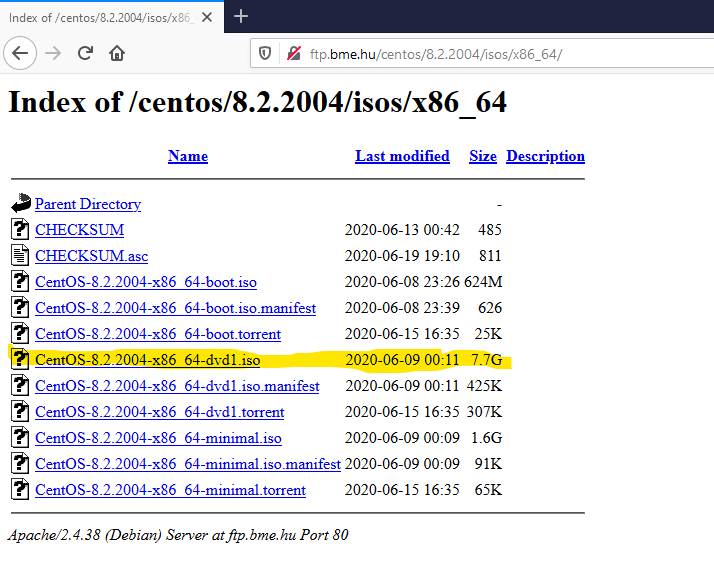

Linux installálás

(segédlet)

CentOS 8.2.2004

# Dokumentum célja

Linux, mint operációs rendszer a Microsoft Windows Server család mellett a másik
jelentős szerv operációs rendszer család. Egyes informatikai szolgáltatások
megvalósításához optimálisabb megoldást ad, mint a Windows. Egy szolgáltatás
bevezetése esetén minden esetben első lépésben meg kell vizsgálni, hogy milyen
operációs rendszer platformon lehet a legjobb megoldást kialakítani.

Ebben a dokumentációban egy step-by-step jelleggel bemutatásra kerül a CentOS
8.2.2004 Linux operációs rendszer installációja. A dokumentum alapját képezi egy
konzultáción bemutatásra kerülő lépésenként átbeszélt telepítésnek, valamint az
ezt követően otthoni munka tárgyát képező egyéni végrehajtásnak. Installáció
virtualizált környezetben történik.

Konfigurációs lépéseket a további Linux dokumentumok tartalmazzák.

# Install média beszerzése

Installálás első lépése, hogy le kell tölteni a médiát. Ehhez el kell dönteni,
hogy melyik Linux disztribúciót kívánjuk telepíteni. Nagyvállalati környezetben
lényeges kérdés a gyártói support, ezért ilyen szempontból a SUSE és a RedHat a
piacvezető (Debian, Ubuntu, … ingyenes, de nem rendelkezik olyan mértékű gyártói
és 3rd party támogatással, ami elvárt). Jelen esetben a RedHat ingyenes
verzióját implementáljuk, ami a CentOS Linux.

Manapság már a telepítő média ISO formátumát használjuk – ami akár kiírható
CR-re, DVD-re, … – mivel a szerverek egyre ritkábban tartalmaznak optikai
meghajtót, valamint ez a formátum támogatott „logikai” optikai meghajtóként való
csatoláshoz.

Első lépésben WEB böngészőben nyissuk meg a következő URL-t:
<https://www.centos.org/download>

A megjelenő oldalon számunkra a CentOS Linux részben az „ISO” oszlopban az
„x86_64” verzióra van szükségünk.

Ezt választva megjelenik egy lista, ahol kiválaszthatjuk, hogy melyik „mirror”
site-ról szeretnénk letölteni az ISO-t. Innen tetszés szerint választhatunk
egyet:

Adott site-on a CentOS 8.2.2004 Linux verzióhoz tartozó médiák listájából
válasszuk ki a CentOS-8.2.2004x86_64-dvd1.iso file-t, és töltsük le, mert ez
tartalmazza az OS-t, valamint több később szükséges tool-t is.

# Installáció

Első lépésben a létrehozott virtuális géphez csatoljuk fel a letöltött ISO
állományt:

Kapcsoljuk be a gépet. Ekkor amennyiben a BIOS-ban beállításra került, hogy a
BOOT sorrendben a CD/DVD meghajtó is használható, akkor elindul a telepítés:

Itt első lépésben a második pont az alapértelmezett, de ISO állomány esetében
felesleges a „média” tesztelése, ezért válasszuk az első pontot, ami maga az
installáció.

Ezt követően grafikus üzemmódra vált az installer, és első lépésben
kiválaszthatjuk az installáció nyelvét:

Érdemes (még ha első lépésben könnyebbnek is tűnik a magyar) az angolt
választani, mivel később bármilyen fellépő probléma esetén a Web-en
nagyságrendekkel több cikk található a megoldáshoz.

Ezt követően megjelenik a „központi” installációs lépernyő:

Amint az itt felsorolt pontokon végigmentünk, akkor kezdődik valóban az
installáció, azaz itt a konfigurálása történik meg az installer-nek.

Vegyük akkor egyesével a 9 pontot:

1.  **Keyboard**

Angol (English) értéken áll. Nem javasolt átállítani, mert bizonyos esetekben a
konzol emulációjánál egyes karakterek a billentyűzetről nem lesznek elérhetők
(pl.: 0-_\|). Valamint, ezt az elérését a gépnek csak az installáció
időtartamára használjuk (később nagyon speciális esetekben pl.: hibaelhárítás
amikor hálózati réteg nem működik). Tehát ezen most nem változtatunk.

1.  **Language Support**

Angol (English) értéken áll. Nem javasolt átállítani, később igény szerint
módosítható. Tehát ezen most nem változtatunk.

1.  **Time & Date**

Ez a pont segít beállítani az időzónát (ahol a szerver telepítésre kerül) és a
dátumot és pontos időt, valamint lehetőség van az NTP bekapcsolására és
konfigurálására, ami az automatikus időszinkronizálást valósítja meg. Ez utóbbit
nem állítjuk be most, mivel ennek előfeltétele egy hibátlanul működő,
felkonfigurált network réteg.

A régió legyen Európa (Region: Europe), a város pedig Budapest (City: Budapest).

Amint egy konfigurációs lapon/formon minden szükséges beállítást elvégeztünk,
akkor a bal felső sarokban a „Done” feliratú gomb segítségével térhetünk vissza
a központi installációs oldalra.

1.  **Installation Source**

A felcsatolt ISO file jelen pillanatban az installációs médiánk, ezen nem
változtatunk, itt lehetne egyébként más forrást is megadni.

1.  **Software Selection**

Többek között a CentOS esetében is, vannak gyártói előre elkészített csomagok,
amik egy adott szolgáltatáskörhöz tartozó alkalmazásokat a függőségeikkel együtt
telepítik. Nekünk elég csak ezeket kiválogatni, a többit az installer
összeállítja.

Jelen esetben cegy „Server” telepítést kérünk (grafikus felület nélkül, azaz a
konzol karakteres), és egy pár hasznos csomagot kérünk hozzá telepíteni:

Hardware Monitoring Utilities  
Performance Tools  
System Tools

Windows esetében is, de Linux installációknál egyértelműen jellemző, hogy csak a
szolgáltatáshoz és a menedzseléshez szükséges alkalmazások kerülnek csak
telepítésre. Ennek az oka: SECURITY (ami nincs felinstallálva, azt egy
rosszindulatú felhasználó/program sem tudja használni).

1.  **Installation Destination**

Jelen esetben még csak egy disk van a szerverhez adva. Amennyiben nem okoz plusz
nehézséget az OS installációs időben ez így kényelmesebb, biztonságosabb,
kevesebb hibázási lehetőséget ad. Amint az operációs rendszer telepítése
befejeződött, a további disk(ek)et is hozzá lehet adni a rendszerhez.
Konfigurációs leírásokban erre kitérünk.

Alapvetően biztonsági okokból egy sokkal tagoltabb felépítést szoktunk használni
Linux operációs rendszerek esetében. Míg Windows-nál a „C:” meghajtóra kerül
„minden”, addig itt a disk-et több partícióra bontjuk funkciók szerint. Továbbá,
míg Windows esetében az egyes partíciók általában betűjellel hivatkozottak (C:,
D:, …), addig UNIX operációs rendszerek esetében mount point-ok vannak, amik az
operációs rendszer egyes könyvtárai lehetnek.

Egy általános felhasználású, operációs rendszer disk felosztása kerül most
bemutatásra az alábbiakban, amit a későbbiekben is érdemes alkalmazni.

Az „Installation Destination” kiválasztását követően a következő lap jelenik
meg:

Látható, hogy egy darab disk van: sda / 80 GiB.

A „Storage Configuration” szekcióban az „Automatic”-ról állítsuk át „Custom”-ra
a konfigurációs módot. Így manuálisan, mi állíthatjuk be, hogy milyen
partíciókat szeretnénk létrehozni a disk-en. Az itt befektetett plusz munka
később, a rendszer production módban való üzemelésénél hatványozottan
kifizetődik.

„Done” gomb lenyomásával indul a partícionálás, ahol a disk-en nem lesz még
semmilyen partíció, azaz teljesen üres.

Alul a rózsaszín négyzetben látható, a még ki nem osztott terület („Available
space”), míg a szürke négyzetben a teljes terület („Total apce”).

Bal alsó részen a „+” jellel lehet új partíciót létrehozni, a „-” jellel a
kiválasztottat törölni.

Első lépésben a két boot területet hozzuk létre:

/boot/efi létrehozása

Kattintsunk a „+” jelre, a megjelenő ablakban a „Mount Point”-hoz válasszuk a
/boot/efi értéket és a méret legyen 1 GByte, azaz 1024 MiB:

Amint ezt beállítottuk, akkor az „Add mount point” gomb segítségével tudjuk a
definíciót jóváhagyni.

Ekkor visszajutunk az előző oldalra. Itt most már azonban látható lesz a
/boot/efi partíció és az adatai:

Ezeken az értékeken ennél a partíciónál ne módosítsunk!

/boot létrehozása

Kattintsunk a „+” jelre, a megjelenő ablakban a „Mount Point”-hoz válasszuk a
/boot értéket és a méret legyen 1 GByte, azaz 1024 MiB:

Amint ezt beállítottuk, akkor az „Add mount point” gomb segítségével tudjuk a
definíciót jóváhagyni.

Ekkor visszajutunk az előző oldalra. Itt most már azonban látható lesz a /boot
partíció is és az adatai:

Ezeken az értékeken ennél a partíciónál ne módosítsunk!

swap létrehozása

SWAP partíció nélkül nem indul el a Linux operációs rendszer. Memória inaktív
lapolási területe. Több is lehet belőle, méretük ekkor összeadódik a
felhasználás során.

Kattintsunk a „+” jelre, a megjelenő ablakban a „Mount Point”-hoz válasszuk a
swap értéket és a méret legyen 4 GByte, azaz 4096 MiB:

Amint ezt beállítottuk, akkor az „Add mount point” gomb segítségével tudjuk a
definíciót jóváhagyni.

Ekkor visszajutunk az előző oldalra. Itt most már látható lesz a swap partíció
is és az adatai:

Látható, hogy most az installer a „Device Type” esetében már nem a „Standard
Partition”-t használja, hanem az „LVM”-et, ami Logical Volume Manager-t jelenti.
Ez dinamikus bővítését teszi lehetővé a partícióknak, melyek ilyen „Volume
Group”-ra kerülnek.

Módosítsuk a „Volume Group”-ot! Kattintsunk a „Modify” gombra:

Adjunk új nevet a volume group-nak, a „Name” mező értékének módosításával:
system_VG

A méretezését pedig a „Size policy”-nél: „As large as possible” értéket, azaz
használja fel az összes rendelkezésre álló helyett.

Ezt követően az alábbiak szerint módosul a partíciós tábla:

/var létrehozása

Ide kerül alap esetben több alkalmazás és az operációs rendszer munka és log
adatai. Mérete hiba esetén „elszabadulhat”, ezért korlátozzuk.

Kattintsunk a „+” jelre, a megjelenő ablakban a „Mount Point”-hoz írjuk be a
/var értéket és a méret legyen 8 GByte, azaz 8 GiB:

Amint ezt beállítottuk, akkor az „Add mount point” gomb segítségével tudjuk a
definíciót jóváhagyni.

Ekkor visszajutunk az előző oldalra. Itt most már azonban látható lesz a /var
partíció is és az adatai:

/tmp létrehozása

Ide kerül alap esetben több alkalmazás és az operációs rendszer temporális
állományai. Mérete hiba esetén „elszabadulhat”, ezért korlátozzuk.

Kattintsunk a „+” jelre, a megjelenő ablakban a „Mount Point”-hoz írjuk be a
/tmp értéket és a méret legyen 8 GByte, azaz 8 GiB:

Amint ezt beállítottuk, akkor az „Add mount point” gomb segítségével tudjuk a
definíciót jóváhagyni.

Ekkor visszajutunk az előző oldalra. Itt most már azonban látható lesz a /tmp
partíció is és az adatai:

/ létrehozása

Root („gyökér”) könyvtár. Ez alá kerül minden könyvtár. Az egyes partíciók is az
ez alatti könyvtárak valamelyikére kerülnek mount-olásra.

Kattintsunk a „+” jelre, a megjelenő ablakban a „Mount Point”-hoz írjuk be a /
értéket és a méret ne legyen kitöltve, ezzel jelezzük, hogy minden fennmaradt
területet ide kívánunk felhasználni:

Amint ezt beállítottuk, akkor az „Add mount point” gomb segítségével tudjuk a
definíciót jóváhagyni.

Ekkor visszajutunk az előző oldalra. Itt most már azonban látható lesz a /tmp
partíció is és az adatai:

Ezzel elkészültünk az alapvető partícionálással.

Megj.: Amennyiben a szerverre beléphetnek felhasználók, akkor a /home
könyvtárnak is külön partíciót ajánlott létrehozni!

A „Done” gomb megnyomásával hagyhatjuk jóvá és írathatjuk ki az elkészült
partíciós táblát, valamint formattáltathatjuk le a partíciókat az alábbi
jóváhagyást követően („Accept Changes”).

1.  **KDUMP**

A dump-olást nem kívánjuk használni, ezért letiltjuk:

1.  **Network & Host Name**

Ebben a pontban lehet a szerver nevét és hálózati kártyájának/kártyáinak
konfigurálását megadni.

A gép neve legyen: centos82.oktatas.local

IPv4 konfiguráció: 172.31.250.151 / 255.255.255.0 / 172.31.250.1

IPv6 konfiguráció: nem használjuk

A „Host Name” mezőbe írjuk be a gép FQDN nevét: centos82.oktatas.local

Ebből a gép neve: centos82

Domain: oktatas.local

Konfiguráljuk be az IP címet, ehhez a „Configure …” gombot használjuk.

A megjelenő ablakban az „IPv6 Settings” fülön állítsuk át a „Method” értékét
„Ignore”-ra.

Majd az ablakban az „IPv4 Settings” fülön állítsuk át a „Method” értékét
„Manual”-ra.

„Add” gomb segítségével adjunk hozzá egy IP címet. Ahol az

„Address”: 172.31.250.151

„Netmask”: 255.255.255.0

„Gateway”: 172.31.250.1

„DNS server”: 172.31.252.3

„Search domains”: oktatas.local

„Save” gombbal elmentjük, majd a megjelenő ablakban „ON”-ra billentjük a kártya
állapotát:

1.  **Security Policy**

Installáció ezen fázisában nem módosítjuk. Mélyebb konfigurációs ismereteket
követően visszatérünk erre a témakörre.

Ezt követően indul a felkonfigurált paraméterekkel az operációs rendszer
telepítése a „Begin Installation” gomb megnyomásával:

Itt még megadhatjuk a „root” user jelszavát:

Biztonságos jelszót adjunk meg!

Installáció végén újra kell indítani a szervert:

Ami boot-olás pillanatában:

Ami az első indulás alkalmával karakteres konzolt biztosít:

# Oktató anyagok

<https://www.youtube.com/watch?v=I4insAOrsME>

<https://linoxide.com/distros/how-to-install-centos/>

<https://phoenixnap.com/kb/how-to-install-centos-8>
