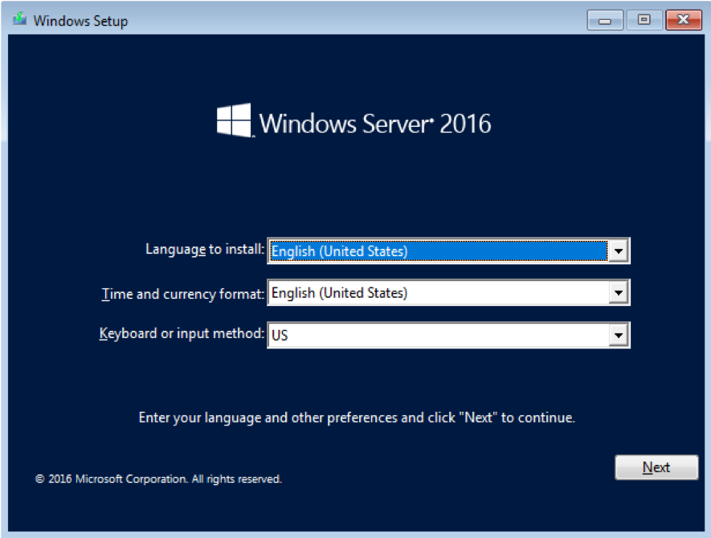

Windows Server 2016 Install és Adminisztrációs segédlet

Section 1: Installing Windows 2016 Server Software
==================================================

### Telepítés megkezdése előtt érdemes tanulmányozni

### 

> Windows Server 2016
>
> [[https://docs.microsoft.com/en-us/windows-server/windows-server-2016]{.ul}](https://docs.microsoft.com/en-us/windows-server/windows-server-2016)
>
> System Requirements for Windows 2016 Server
>
> [[https://docs.microsoft.com/en-us/windows-server/get-started/system-requirements]{.ul}](https://docs.microsoft.com/en-us/windows-server/get-started/system-requirements)
>
> Important Issues in Windows Server 2016
>
> [[https://docs.microsoft.com/en-us/windows-server/get-started/windows-server-2016-ga-release-notes]{.ul}](https://docs.microsoft.com/en-us/windows-server/get-started/windows-server-2016-ga-release-notes)

### Legjobb gyakorlatok (Best Practicies)

### 

-   Soha ne telepítsünk új rendszert a nyilvános hálózatra.

-   Először indítsuk el a rendszert egy fejlesztői/teszt környezetben,
    majd utána helyezzük át az éles környezetbe.

-   A patch-eket azonnal installáljuk a telelpítést követően

-   Alkalmazzuk a biztonsági beállításokat a rendszerre.

-   Tűzfal konfigurálása.

-   Telepítsük és frissítsük a víruskereső szoftvert.

-   Ellenőrizzük az összes beállítást.

-   A rendszer frissítések előtt készítsünk teljes biztonsági másolatot!

1\. Kapcsolja be a rendszert, és helyezze be a telepítőlemezt

a\. Ha a BIOS indítási sorrendje nincs beállítva a CD / DVD meghajtóról
történő indításra, akkor a telepítés megkezdése előtt módosítani kell
ezeket a beállításokat

2\. Válasszuk ki a Nyelv, Idő és pénznem formátumot, valamint a
Billentyűzet beviteli módot.

3\. Kattintsumk a Tovább gombra.

+----------------------------------+----------------------------------+
| > {width="2.133079615048119in" |
| /A%20Server%202016%20Install%20i | > height="1.2312489063867016in"} |
| so%202%20Main.png](media/image2. | >                                |
| png){width="4.734520997375328in" | > a\. Ezt az üzenetet fogjátok   |
| > height="3.491874453193351in"}  | > látni "Setup is starting".     |
| >                                |                                  |
| > 4\. Kattintsunk az Install     |                                  |
| > now-ra                         |                                  |
+----------------------------------+----------------------------------+

+----------------------------------+----------------------------------+
| > {width="2.9831222659667542in" | png){width="3.276049868766404in" |
| > height="2.458957786526684in"}  | > height="2.474374453193351in"}  |
+----------------------------------+----------------------------------+

b\. Az iso telepítés a számítógép javításához is használható.

Ha a fenti Windows telepítő képernyőn a Számítógép javítása lehetőséget
választjuk, akkor a rendszer megkéri, hogy végezzük el a számítógép
hibakeresését (Troubleshoot) vagy kikapcsolását (Turn off your PC)

> ii\. Ha a Hibaelhárítás (Troubleshoot) lehetőséget választjuk, vagy
> kereshet egy System Image fájlt a Windows helyreállításához, vagy
> elindíthat egy Parancssorot (Command Prompt).

iii\. A témában érdemes átnézni az alábbi dokumentációkat:

<https://technet.microsoft.com/library/cc755163.aspx>

> Wbadmin Start sysrecovery:
> [[https://technet.microsoft.com/en-]{.ul}](https://technet.microsoft.com/en-us/library/cc742118(v%3Dws.11).aspx)
> [[us/library/cc742118(v=ws.11).aspx]{.ul}](https://technet.microsoft.com/en-us/library/cc742118(v%3Dws.11).aspx)

{width="5.932367672790901in"
height="4.43437445319335in"}

5\. Válasszuk ki a telepíteni kívánt operációs rendszert.

> a\. Az alapértelmezett beállítás a Windows Server 2016 Standard. Ez a
> Server Core Edition, amelyet a parancssoron,Powershell-en vagy a
> távolról kezelhető. A Server Core a Microsoft által ajánlott opció.

b\. A Windows Server 2016 Standard (Desktop Experience) a grafikus
felülettel töltődik be.

> c\. Ha egyik operációs rendszer opcióról szeretne váltani a másikra,
> akkor azt csak úgy tehetjük . Teljes újratelepítést kell
> végrehajtania.

6\. Kattintsunk a Next-re

> {width="1.281036745406824in"
> height="2.3785411198600177in"}

{width="5.96999343832021in"
height="4.4625in"}

7\. Olvassuk el a licencfeltételeket.

a\. Telepítés előtt olvassa el és fogadja el a licencelési feltételeket.

b\. Csak akkor folytatható a telepítést, ha a licencfeltételek
elfogadásra kerülnek.

8\. Kattintsunk a Tovább gombra

{width="5.96999343832021in"
height="4.4625in"}

9\. Válasszuk ki, hogy milyen típusú telepítést szeretnénk?

a\. Frissítés

Ez az opció akkor használható, amikor frissítjük a Windowst egy előző
verziójáról.

ii\. Minden fájl, beállítás és program sértetlen marad.

b\. Egyedi

Ez az opció a Windows új példányának telepítésére szolgál

ii\. Törli a meghajtó és minden rajta lévő adatot!

10\. Válasszuk új telepítés, kattintsunk a Custom: Install Windows only
(advanced)

{width="5.141245625546807in"
height="3.8674989063867016in"}

11\. Hova szeretnénk telepíteni a Windows rendszerünket?

a\. Válasszuk ki a Windows telepítéséhez használni kívánt meghajtót.

b\. Ha a merevlemezt nem találja, akkor be kell töltenie a megfelelő
illesztőprogramokat.

Kattintson az Illesztőprogram betöltésére (Load driver)

{width="4.120138888888889in"
height="1.6770833333333333in"}

ii\. Az illesztőprogram ezután CD, DVD vagy USB meghajtóról tölthető be.

> iii\. Az illesztőprogram betöltése után a merevlemez opcióként
> szerepel a telepítővarázslóban.

c\. További opciók: Törlés, Új, Kiterjesztés, Formátum (Delete, New,
Extend, Format)

Ha töröljük az aktuális partíciót:

ii\. Hozzunk létre egy új partíciót

> iii\. Terjesszük (Extend) ki a partíciót, amely lehetővé teszi a
> partíció nagyobbá tételét. Ez a művelet nem vonható vissza!

iv\. Formázzuk a partíciót

d\. Ha ez egy új lemez, akkor semmilyen más műveletet nem kell
végrehajtani. A következő gombra kattintva automatikusan létrehoz egy
partíciót a teljes lemez felhasználásával, formázza és elindítja a
telepítést.

12\. Kattintson a Tovább gombra.

{width="5.969866579177602in"
height="4.4625in"}

{width="5.989583333333333in"
height="1.461111111111111in"}

13\. A Windows installálása folyamatban

{width="5.970061242344707in"
height="4.453124453193351in"}

14\. A Windows a telepítést követően újraindul

15\. A Windows frissít és újraindul

{width="1.4590715223097113in"
height="2.7416666666666667in"}{width="1.5006944444444446in"
height="3.2040277777777777in"}{width="1.4889643482064743in"
height="2.721353893263342in"}

{width="5.9602471566054245in"
height="3.685416666666667in"}

16\. Adjuk meg a rendszergazdai fiók jelszavát.

17\. Győződjünk meg arról, hogy a jelszó választásnál betartjuk-e a
szervezetünk jelszóra vonatkozó irányelveket.

a\. Elkerülendő a rendszer feltöröését a jelszónak 18-20 karakter
hosszúnak kell lennie.

> b\. A Microsoft további információ itt található:
> <https://www.microsoft.com/en-us/research/wp-content/uploads/2016/06/Microsoft_Password_Guidance-1.pdf>

18\. Kattintsunk a Befejezés (Finish) gombra.

19\. A jelszó be lett állítva.

Section 2: Windows Server 2016 Initialization
=============================================

{width="4.8in" height="4.289583333333334in"}

1.  Jelentkezzünk be a rendszergazda fiókba a telepítés során
    létrehozott jelszóval.

{width="2.416178915135608in"
height="3.0834372265966756in"}

2.  Először megjelenik egy üzenet, amely megkérdezi, hogy engedélyezi-e
    a hálózati felfedezhetőséget (Network discovery)

    a.  Ez lehetővé teszi, hogy az engedélyezett számítógépet a hálózat
        többi számítógépe is láthassa.

{width="5.965972222222222in"
height="5.2965277777777775in"}

b.  Ha az Igen gombra kattint, akkor a Windows tűzfalban engedélyezi a
    Hálózati felfedezés (Network Discovery) alkalmazást csak a privát
    hálózathoz. Ez a beállítás a Vezérlőpult\> Windows tűzfal\>
    Alkalmazások vagy szolgáltatások engedélyezése a Windows tűzfalon
    (Control Panel \> Windows Firewall \> Allow an app or feature
    through Windows Firewall) keresztül érhető el.

{width="5.968944663167104in"
height="4.40625in"}

c.  Ha a Nem gombra kattintunk, vagy elmulasztja a párbeszédet ablakot,
    akkor ez az opció újrakonfigurálható.

    i.  Válassza a Vezérlőpult\> Hálózati és megosztási központ
        menüpontot (Control Panel \> Network and Sharing Center). A bal
        oldali menüopciókban kattintson a Speciális megosztási
        beállítások (Change advanced sharing) módosítása elemre.

    ii. Testreszabható privát, vendég vagy nyilvános, valamint minden
        hálózat számára (Private, Guest, Public és All Networks)

    iii. Előfordulhat, hogy vissza kell térnünk a Windows tűzfalra, és
         engedélyeznie kell a Hálózati felderítést, amint azt az előző
         utasítás jelzi.

{width="2.9732556867891513in"
height="0.5765616797900263in"}

3.  Értesítéseket küld a rendszer a tálcán látható módon (is).

{width="2.94127624671916in"
height="2.0208333333333335in"}

4.  Ez egy Action Center értesítés a Windows SmartScreen
    bekapcsolásáról.

> a\. A Windows-ban SmartScreen alapértelmezés szerint le van tiltva, és
> a csoportházirenden keresztül egy tartományi rendszergazdai fiókkal
> engedélyezhető.
>
> b\. A Windows SmartScreen az Internet Explorer és a Microsoft Edge
> böngészőkkel működik, összehasonlítva a meglátogatott webhelyek
> URL-jét a szűrővel integrált nagy forgalmú webhelyek listájával. Ha a
> webhely nem egyezik a listával, a SmartScreen szűrők lekérdezést küld
> a megfelelő URL-hírnevszolgáltatáshoz (Reputation Service). Ha az
> URL-t nem biztonságosnak minősíti,akkor a szűrő üzenetet jelenít meg a
> felhasználó számára, hogy figyelmeztesse őt a személyes adatok
> bevitelére vagy tartalom letöltésének veszéleyeira az webhelyről.
>
> c\. A telemetria a webhelyre vonatkozó további információk jelentésére
> szolgál.
>
> d\. A szoftverek használatához IPv4-kapcsolat szükséges.
>
> Bővebben a SmartScreen-ről:
> <https://docs.microsoft.com/en-us/previous-versions/windows/it-pro/windows-server-2012-R2-and-2012/jj618329(v=ws.11)?redirectedfrom=MSDN#BKMK_How>
>
> A SmartScreen Windows 10-es operációs rendszeren is elérhető:
>
> <https://www.youtube.com/watch?v=15a2qUM_EpY>

{width="3.50625in" height="0.8868055555555555in"}

> Amíg nem aktiválja a Windows Server operációs rendszerét,addig ez az
> üzenet fog megjelenni az asztal jobb alsó sarkában.

Section 3: Welcome to Server Manager
====================================

{width="6.529954068241469in"
height="4.72614501312336in"}

A Kiszolgálókezelő irányítópultján (Server Manager Dashboard) egy
pillanat alatt megtaláljuk a szerverre telepített összes szerepkört, és
értesítéseket fogunk kapni minden hibáról vagy poblémáról. A hiperlink
opció az egyes menük gyors indítási lehetőségeit kínálja.

A Server 2016-nál régebbi operációs rendszereket futtató kiszolgálók
kezeléséhez telepítenie kell a következő szoftvereket és frissítéseket a
távoli kiszolgáló(k)ra:

[[https://docs.microsoft.com/en-us/windows-server/administration/server-]{.ul}](https://docs.microsoft.com/en-us/windows-server/administration/server-manager/server-manager)
[[manager/server-manager]{.ul}](https://docs.microsoft.com/en-us/windows-server/administration/server-manager/server-manager)

1.  Kattintson a (1) A helyi kiszolgáló (Local Server) konfigurálása
    megtekintésre a Szerver tulajdonságainak szerkesztéséhez, vagy
    kattintson a Helyi kiszolgáló elemre a bal oldali menü ablaktáblán.
    A konfigurációs lehetőségek a következők:

    a.  Számítógép neve (Computer Name)

    b.  Munkacsoport / Tartomány (Workgroup/Domain)

    c.  Windows tűzfal (Windows Firewall)

    d.  Távoli elérési lehetőség (Remote Access Option)

    e.  Konfigurálja a Windows frissítéseket (Configure Windows Updates)

    f.  Állítsa be az idő / időzónát (Set the time/time zone)

    g.  Lásd az operációs rendszer és a hardver részleteit (See
        operating systems and hardware details)

    h.  Események megtekintése (View Events)

    i.  Hozzáférési szolgáltatások (Access Services)

    j.  Futtassa a legjobb gyakorlatok elemzőjét (Run the Best Practices
        Analyzer)

    k.  A teljesítmény részleteinek megtekintése (View Performance
        details)

    l.  Szerepek és szolgáltatások megtekintése és szerkesztése (View
        and Edit Roles and Features)

2.  Szerepek és szolgáltatások hozzáadása (Add roles and features),
    elindítja a varázslót szerepkörök vagy szolgáltatások hozzáadásához
    vagy eltávolításához.

[GYAKROLAT]{.ul}

3.  Adjunk hozzá további kiszolgálókat a kezeléshez (legfeljebb 100, a
    kiszolgáló rendelkezésére álló hardver- és hálózati erőforrásoktól
    függően), adjunk hozzá tartomány- és munkacsoport-kiszolgálókat a
    három módszer egyikével (lásd:
    [[https://docs.microsoft.com/en-us/windows-server/administration/server-manager/add-servers-to-server-]{.ul}
    [manager]{.ul}](https://docs.microsoft.com/en-us/windows-server/administration/server-manager/add-servers-to-server-manager)):

> a\. Active Directory
>
> b\. DNS
>
> c\. Importálás

4.  Hozzunk létre egy kiszolgálócsoportot, amely lehetővé teszi a
    rendszerek logikai csoportosítását, figyelemmel kísérését és
    kezelését. Például egy adatbázis-kiszolgálók csoportja (Group of
    Databse Servers), egy IIS-csoport (IIS Group) vagy egy fájlszerverek
    csoportja és így tovább.

5.  Csatlakoztassa ezt a kiszolgálót a felhőszolgáltatásokhoz, elindít
    egy böngészőt a webhely betöltéséhez,
    [<https://www.microsoft.com/en-us/cloud-platform/operations-management-suite>.]{.ul}

További hasznos információk:

Add roles and features Windows Server 2016:
<https://www.youtube.com/watch?v=De4NH7OYXc8>

Install Server Manager on Windows 10:
<https://www.youtube.com/watch?v=TuRzRgdaZRk>

Server Manager:
<https://docs.microsoft.com/en-us/windows-server/administration/server-manager/server-manager>

### SERVER MANAGER HASZNÁLATA

### 

### A Server Manager megfelelő használata a szerver hatékony kezelésének egyik kulcsa

### 

#### {width="6.998876859142607in" height="0.43312445319335086in"}Server Manager Console Header:

### 

A Kiszolgálókezelő tetején balra nyilakat és navigációs lehetőségeket
találunk. A jobb oldalon található egy Frissítés gomb, a befejezett vagy
függőben lévő feladatok értesítési jelzője és egyéb menüopciók,
amelyekkel gyorsan kezelhetjük szerverünket, elérhetjük az eszközöket,
megváltoztathatjuk a nézetet vagy kereshetünk a súgó dokumentációjában.

#### {width="2.951407480314961in" height="0.48812445319335085in"}The Notifications Area:

A zászló ikon jelzi az Értesítések területet, és megjeleníti a
folyamatban lévő, függőben lévő vagy további műveleteket igénylő feladat
részleteit. Az ikon mellett egy szám jelzi, hogy függőben lévő üzenetek
vannak.

{width="3.0111264216972877in" height="0.5in"}

Ha megjelenik egy figyelmeztető háromszög, ez azt jelenti, hogy vannak
függőben lévő feladatok, amelyek azonnali figyelmet igényelnek.

{width="3.0007939632545932in"
height="2.6333333333333333in"}

A zászlóra kattintva megjelenik a függőben lévő esemény előrehaladása,
valamint egy link további információkra. A függőben lévő feladatok
elvégzéséhez egy link irányít minket a következő lépésre.

#### {width="3.029861111111111in" height="1.886111111111111in"}Manage:

> A Manage menü a következő lehetőségeket kínálja:
>
> 1\. Add Roles and Features
>
> 2\. Remove Roles and Features o
>
> 3\. Add Servers
>
> 4\. Create Server Group
>
> 5\. Server manager Properties

{width="4.549757217847769in"
height="2.0305205599300087in"}

> Alap beállítás

#### Tools:

> Default Available Tools:
>
> {width="3.021946631671041in"
> height="6.012083333333333in"}

A Tools menü közvetlen hozzáférést biztosít az Felügyeleti eszközök
(Administrative Tools) parancsokhoz. Ez a leggyorsabb módszer a
felügyeleti eszközök elérésére. Amint további szerepköröket és
szolgáltatásokat telepítünk a szerverre, ebben a menüben további
parancsikonok jelennek meg. Az Eszközök menü szintén testreszabható.
Ennek kezelési lehetőségeiről itt lehet bővebben tájékozódni:

<https://docs.microsoft.com/en-us/windows-server/administration/server-manager/manage-the-local-server-and-the-server-manager-console>

#### {width="2.524479440069991in" height="2.31in"}View:

Az alapértelmezett Server Manager nézet 100% -ra van állítva. A View
menüben lehetmódosítani nagyítását.

#### {width="3.086550743657043in" height="1.9089577865266842in"}Help:

> A Server Manager Help az alapértelmezett böngészőt ide irányítja:
> [[https://technet.microsoft.com/library/2194da26-7e64-4497-b4ee-c2d815f655c0]{.ul}](https://technet.microsoft.com/library/2194da26-7e64-4497-b4ee-c2d815f655c0).
>
> A Windows Server Marketplace ide mutat:
> <https://www.windowsservercatalog.com>. Windows Server TechCenter erre
> az oldalra irányít:
> [[https://technet.microsoft.com/en-us/library/hh831456]{.ul}](https://technet.microsoft.com/en-us/library/hh831456).

### KÖTELEZŐ BEÁLLÍTÁSOK

### 

#### Set the Time Zone

1.  A Server Manager irányítópultján kattintson a Local Server-re a bal
    oldali menü ablaktábláján

{width="6.191865704286964in" height="3.3125in"}

2.  Kattinsunk az Időzóna (Time Zone) linkre

3.  {width="3.7375in"
    > height="3.929375546806649in"}Kattintsunk a Change time zone-ra

### 

> {width="3.7143963254593175in"
> height="2.0299989063867017in"}

4.  A legördülő menüből válasszuk ki a megfelelő időzónát, majd
    > kattintson az OK gombra

{width="3.532470472440945in"
height="3.6891666666666665in"}

5.  További órákat a További órák (Additional Clocks) fülről is
    beállíthatunk.

> {width="3.468485345581802in"
> height="3.6406244531933507in"}

6.  Az alapértelmezett internetes időszerver szinkronizálva van az
    > „time.windows.com" címmel. Ez az Internet Idő (Internet Time)
    > fülről szerkeszthető.

    a.  Kattintsunk a Change settings-re

{width="3.6816502624671914in"
height="2.1845833333333333in"}

b.  A legördülő menüből válasszuk ki a megfelelő szervert:
    time.nist.gov.

c.  Kattintsunk az Update now-ra. Ez kikényszeríti az idő frissítését a
    > rendszerre, amint az internetes időszerver be van állítva

d.  Kattinstsunk az OK-ra.

### Új hálózati kártya/kártyák beállítása

### 

1.  A Server Manager Dashboard-onkattintsunk a Local Server elemre a bal
    oldali menüben.

    a.  Ha már csatlakoztunk a privat hálózathoz és van internet
        hozzáférésünk, akkor az IP cím megváltoztatását utoljára is
        tehetjük.

    b.  Ha csatlakozni szeretnénk a hálózathoz, akkor statikus IP-címet
        > kell beállítanunk a folytatáshoz.

{width="6.177176290463692in"
height="3.3366666666666664in"}

2.  Kattintsunk az Ethernet0 linkre

{width="3.214475065616798in"
height="3.1877077865266843in"}

3.  A Network Connections ablakban nyomjunk egy jobb az Ethernet0-on és
    > válasszuk a Properties menüt.

4\. Jelöljük ki az Internet Protocol 4-es verziót (TCP / IPv4).
Kattintsunk a Tulajdonságok (Properties) elemre.

Ha a hálózat az IPv6-ra van állítva, akkor az Internet Protocol 6-os
verziót (TCP / IPv6) kell választani az Ethernet0 Tulajdonságok
ablakban, és kattintani a Tulajdonságok gombra a konfiguráláshoz.

{width="2.9208333333333334in"
height="3.7736111111111112in"}

> 5\. Töltsük ki a hálózatának megfelelő IP-információkat. Írjuk be a
> statikus IP-címet (IP address), az alhálózati maszkot (Subnet mask) és
> a hálózati alapértelmezett átjárót (Default gateway). A
> tartományvezérlőjének előnyben részesített DNS-kiszolgálója az adott
> DC lesz, és az alternatív DNS-kiszolgáló egy másik DC lehet a
> hálózaton. Kattintsunk az OK gombra.
>
> {width="3.269663167104112in"
> height="3.6800076552930885in"}6. Amikor befejeztük a konfigurálást,
> akkor kattintsunk az OK gombra.
>
> {width="5.795382764654418in"
> height="2.2574989063867017in"}
>
> 7\. IP-cím hozzárendelésekor nevezzük át a hálózati kártyát a hálózati
> kártyák megkülönböztetése és az ip / hálózat gyors azonosítása
> érdekében. Ezt lehet név vagy IP alapján, amelyik számunkra
> célravezetőbb. Ha egynél több hálózati kártya van telepítve, akkor
> tiltsuk le a nem használt kártyát/kártyákat.

### SZÁMÍTÓGÉP NEVÉNEK MEGVÁLTOZTATÁSA

### 

1.  A Server Manager Dashboard-on kattintsunk a Local Server-re a bal
    oldali menüben.

{width="6.176996937882764in"
height="3.3366666666666664in"}

2.  Kattintsunk a Computer name linkre.

{width="3.5081944444444444in" height="4.03in"}

3.  A Computer Name tab-on kattintsunk a Change-re.

> {width="3.2428543307086612in"
> height="3.8362489063867016in"}

4.  Adjuk meg az új gépnevet a Computer name mezőben, majd nyomjunk
    > OK-ét. Ugyanitt van lehetőségünk a domain-be léptetésre is, akkor
    > a Domain mezőt is ki kell tölteni (erről később lesz szó)

{width="2.977798556430446in"
height="1.4784372265966754in"}

5.  A változtatások véglegesítéséhez újra kell indítani a gépet.
    Kattintsunk az OK gombra.

6.  Zárjuk be a System Properties ablakot.

{width="2.969258530183727in"
height="1.349582239720035in"}

7.  Kattintsunk a Restart Now-ra.

8.  A szerver újraindul.

### Windows Update

1.  A Server Manager Dashboard-on kattintsunk a Local Server-re a bal
    oldali menüben.

{width="6.151031277340333in"
height="3.296561679790026in"}

2.  Keressük meg a Windows Update funkcióra mutató linket.

    a.  Az alapértelmezett beállítás: frissítések letöltése a Windows
        Update használatával. Ami azt jelenti, hogy az Automatikus
        frissítés engedélyezve van, és a frissítések mindig letöltésre
        kerülnek, [de konfigurálnunk kell, hogy mikor kell telepítjük
        őket]{.ul}. Kattintsunk a hivatkozásra a lehetőségek
        megtekintéséhez.

    b.  A Windows Update elérésének másik lehetősége: bal egérgombbal
        kattintsunk a Start menüre, majd a Beállítások\> Frissítés és
        biztonság elemre

> {width="5.832125984251968in"
> height="4.449374453193351in"}

3.  Előfordulhat, hogy már rendelkezünk frissítésekkel, amelyeket
    telepíthetünk. Ehhez kattintsunk a Telepítés gombra.

{width="2.855757874015748in"
height="1.1906244531933508in"}

> 4\. Kattintsunk a Check for updates-re egészen addig,amíg arendsze nem
> jelezi számunkra, hogy a rendszerünk rendelkezik minden frissítéssel
> (Your device is up to date).
>
> 5\. A Windows Update-hez elérhető opciók:

{width="5.743744531933508in"
height="4.501457786526684in"}

a.  Update history

{width="6.144666447944007in"
height="3.033333333333333in"}

b.  Aktív használati idő beállítása.

> {width="5.4610301837270345in"
> height="2.8218744531933506in"}
>
> c\. Újraindítási lehetőségek

{width="5.776208442694664in"
height="2.841666666666667in"}

##### d. Haladó beállítás: Ügyeljünk arra, hogy a 'Give me updates for other Microsoft products when I update Windows.'opció legyen kipipálva, mert ez alapból nincs engedélyezve! 

További információkat lehet itt olvasni:

> [[https://blogs.technet.microsoft.com/mu/2017/06/27/patching-with-windows-]{.ul}](https://blogs.technet.microsoft.com/mu/2017/06/27/patching-with-windows-server-2016/)
> [[server-2016/]{.ul}](https://blogs.technet.microsoft.com/mu/2017/06/27/patching-with-windows-server-2016/)

### Remote Desktop engedélyezése

### 

1.  A Server Manager Dashboard-on kattintsunk a Local Server-re a bal
    oldali menüben.

{width="6.178281933508312in"
height="3.3366666666666664in"}

2.  A Remote Desktop alap beállítása: Disabled, azaz le van tiltva.
    Kattintsunk a 'Disabled' linkre.

3.  {width="3.285416666666667in"
    > height="3.7316108923884515in"}A System Properties ablakon
    > válasszuk Remote tab-ot. Válasszuk az Allow remote connections to
    > this computer lehetőséget.

    a.  Tartsuk szem előtt, hogy a RD érzékeny a Man-in-the-Middle
        támadásokra.

    b.  Amennyiben lehetséges korlátozzuk a Remote Desktop hsaználatát a
        belső hálózatra vagy csatlakozzunk VPN-en vagy Direct Access-en.

> {width="3.3249650043744534in"
> height="1.8in"}

4.  A riasztás arra vonatkozik, hogy engedélyezzük a Távoli asztali
    > elérést a tűzfalon. Nyugtázza a riasztást, és kattintson az OK
    > gombra.

{width="6.1828947944007in"
height="4.626874453193351in"}

5.  A Távoli asztal engedélyezése a tűzfalon: Vezérlőpult\> Windows
    > tűzfal\> Alkalmazások vagy szolgáltatások engedélyezése (Allow
    > apps to communicate through Windows Firewall)

Section 4: Domain Controller telepítése
=======================================

### Definíciók

### 

> **[Roles]{.ul} (Szerepek)** A szerepek olyan szoftverprogramok,
> amelyek megfelelő telepítés és konfigurálás esetén automatikusan
> működnek, hogy több felhasználó és / vagy számítógép számára
> hozzáférést biztosítsanak a hálózaton belüli erőforrásokhoz. Példák:
> DHCP, Active Directory és DNS, File Services, Print Server Services
> stb. A szerepkörök általában saját adatbázisokat tartalmaznak,
> sorbaállíthatják a kérelmeket vagy információkat rögzíthetnek a
> hálózati résztvevőkről. Egy vagy több szerepkör telepíthető a
> szerverre, a hardver képességeitől függően
> (<https://docs.microsoft.com/hu-hu/windows-server/administration/server-core/server-core-roles-and-services>
> )
>
> **[Role Services]{.ul}** -- a szolgáltatások olyan szoftver programok,
> amelyek funkcionalitást adnak a szerephez (Role-okhoz). Egyes
> szerepköröknek csak egy meghatározott funkciójuk van, és nincs további
> szerepszolgáltatásuk. Más szerepkörökhöz bizonyos
> szerepkör-szolgáltatások szükségesek
> (<https://docs.microsoft.com/hu-hu/windows-server/administration/server-core/server-core-roles-and-services>
> )
>
> **[Features]{.ul}** -- A funkciók opcionális szoftverprogramok,
> amelyek közvetlenül elérhető kapcsolat nélkül telepíthetők a
> rendelkezésre álló szerepektől függetlenül.
> (<https://docs.microsoft.com/hu-hu/windows-server/administration/server-core/server-core-roles-and-services>
> )
>
> **[Functions]{.ul}** - A funkciók a telepíthető elsődleges szerepkörök
> másodlagos vagy támogató tulajdonságai. A kiszolgálókezelési vagy
> adminisztrációs felügyeleti funkciók (MMC) meghatározása, fájlok
> biztonsági mentése.
>
> **[AD DS]{.ul}** -- Az Active Directory tartományi szolgáltatások a
> Windows Server címtárszolgáltatási adatbázisa, amelyet
> bejelentkezések, hitelesítés és címtárkeresések feldolgozására
> használnak. Tartományvezérlőre telepítve kezeli a felhasználók és
> tartományok közötti kommunikációt.

### Ajánlott linkek a témában

### 

> Step-by-Step Guide for Setting up a Windows Server 2016 Domain
> Controller
> [[http://www.tactig.com/install-windows-server-step-by-step/]{.ul}](http://www.tactig.com/install-windows-server-step-by-step/)
> [[http://www.tactig.com/install-active-directory-domain-services-ad-ds/]{.ul}](http://www.tactig.com/install-active-directory-domain-services-ad-ds/)
> [[http://www.tactig.com/promote-windows-server-domain-controller/]{.ul}](http://www.tactig.com/promote-windows-server-domain-controller/)
>
> Upgrade and Conversion Options for Windows Server 2016
> [[https://docs.microsoft.com/en-us/windows-server/get-started/supported-upgrade-paths]{.ul}](https://docs.microsoft.com/en-us/windows-server/get-started/supported-upgrade-paths)
>
> In-Place Domain Controller Upgrade from Windows Server 2012R2 to 2016
> [[https://www.virtualizationhowto.com/2016/11/upgrade-windows-server-2012-r2-domain-controller-to-]{.ul}](https://www.virtualizationhowto.com/2016/11/upgrade-windows-server-2012-r2-domain-controller-to-windows-server-2016/)
> [[windows-server-2016/]{.ul}](https://www.virtualizationhowto.com/2016/11/upgrade-windows-server-2012-r2-domain-controller-to-windows-server-2016/)
>
> What's New in Windows Server 2016 Active Directory
>
> [[https://docs.microsoft.com/en-us/windows-server/identity/whats-new-active-directory-domain-services]{.ul}](https://docs.microsoft.com/en-us/windows-server/identity/whats-new-active-directory-domain-services)

### ACTIVE DIRECTORY DOMAIN SERVICES TELEPÍTÉSE

### 

A következő lépések segítséget nyújtanak abban, hogy hogyan kell
konfigurálni egy Active Directory tartományvezérlőt. A DNS a Microsoft
Active Directory tartomány szerves része, ezért először be kell állítani
és tesztelni kell a megfelelő működés érdekében. Egy Windows tartományon
belül minden szolgáltatás működéséhez DNS-re van szükség.

A Microsoft best practices serint legalább két tartományvezérlőt kell
telepíteni egy tartományban. Ha egynél több tartományvezérlővel
rendelkezünk, akkor a redundancia és a folyamatos működés akkor is
lehetséges, ha az egyik DC meghibásodik. A második DC továbbra is
feldolgozza a felhasználói bejelentkezéseket és a DNS-kéréseket,
továbbra is alkalmazza a csoportházirendet, és fenntartja az Active
Directory környezetet. Egyetlen DC használata rendkívül kockázatos, így
ezt ajánlatos elkerülni!

{width="6.595484470691163in"
height="3.061874453193351in"}

1.  Kattintsunk az Add roles and features menüre a Server Manager
    Dashboard-on vagy válasszuk a Manage menü opciót.

    a.  Mielőtt elkezdenénk a telepítést ellenőrizzük a következőket:

        i.  Rendelkezünk egy erős Administrator jelszóval.

        ii. Beállítottunk egy statikus IP címet.

        iii. Telepítettünk minden elérhető Microsoft update-et.

    b.  Kattintsunk a Next-re.

> {width="6.373572834645669in"
> height="2.4029166666666666in"}A varázsló

2.  Válasszuk ki a telelpítés típusát:

    a.  Kattintsunk a Role-Based or Feature-based installation-re

    b.  Majd Next.

{width="6.41415791776028in"
height="4.316666666666666in"}

3.  Válasszuk ki a célszervert

    a.  Szerver kiválasztása a server pool-ból

    b.  Majd Next.

> {width="6.182530621172353in"
> height="4.34625in"}

4.  Válasszik ki a szükséges szerver role-okat (szerepeket):

    a.  Amikor kiválasztunk egy role-t a listából, akkor egy rövid
        > leírást kapunk róla (Description)

    b.  Itt kiválaszthatjuk a számunkra szükséges Role-okat.

    c.  Válasszuk ki az Active Directory Domain Services-t.

    d.  {width="3.2731813210848646in"
        > height="3.3452154418197724in"}A Roles Wizard mindig jelzi,
        > hogy etelpítsük az adott role használatához szükséges további
        > szolgáltatásokat.

        i.  Az Active Directory Domain Services Role használatához
            > szükséges további szolgáltatások : Group Policy
            > Management, Remote Server Administration Tools, Active
            > Directory Module for Powershell, Active Directory
            > Administrative Center és AD DS Snap-ins & Command Line
            > Tools

        ii. ##### Az "Include management tools (if applicable)" opciót hagyjuk bejelölve.

        iii. Kattintsunk az Add Features gombra, enélkül ugyanis nem
             > tudjuk folytatni a varázsló futtatását.

    e.  Kattintsunk a Next gombra.

> {width="6.071404199475066in"
> height="4.25in"}

5.  Kiválasztott jellemzők (Features):

    a.  Ha végiggörgetjük ezt a listát, akkor észrevehtjük, hogy az
        előző parancssoron keresztül hozzáadott szolgáltatások vannak
        kiválasztva. Ehhez a telepítéshez jelöljük be a .NET Framework
        3.5-öt.

    b.  Amikor kiemelünk egy Feature-t a listából, akkor a job oldalom
        > megjelenik a leírása (Description)

    c.  Kattintsunk a Next-re.

> {width="6.215684601924759in"
> height="4.1628116797900265in"}

6.  Active Directory Domain Services.

    a.  Kapunk egy leírást az AD DS-ről, ezt érdemes elolvasni.

    b.  Kapunk egy jótanácsot, hogy telepítsünk legalább két DC-t,
        elkerülendő a szolgáltatás kimaradásokat.

    c.  AD DS-hez DNS kiszolgáló szükséges. Ha nem talál ilyet a
        rendszer, akkor kérni fogja ennek a szerepkörnek a telelpítését.

    d.  Egy hasznos leírás az Azure Active Directory services-ről (a
        felhő szolgáltatásoknál erről beszélni fogunk részletesebben):
        [[https://azure.microsoft.com/en-us/services/active-directory/]{.ul}](https://azure.microsoft.com/en-us/services/active-directory/)

    e.  Kattintsunk a Next-re.

{width="6.116438101487314in"
height="4.338333333333333in"}

> 7\. Confirmation

a.  A NET 3.5 keretrendszer hozzáadása okozza a fenit figyelmzetést: "Do
    you need to specify an alternate source path?" A Windows Server 2016
    nem telepítője nem tartalmazza alapértelmezetten a 3.5-ös
    keretrendszert.

    i.  Ha a szerver hozzáfér a Windows Update szolgáltatáshoz, a
        > telepítés befejeződik anélkül, hogy alternatív forrásútvonalat
        > kellene megadnia.

    ii. Ha a Windows Update nem érhető el, a telepítőfájlok a Server
        > 2016 .iso fájlból érhetők el. Csatlakoztassuk az .iso
        > fájlokat, és kattintsunk az „Alternatív forrásútvonal
        > megadása" linkre. Az induló ablakban írjuk be az elérési utat:
        > \<az .iso meghajtóbetűje\> \\ sources \\ sxs. Kattintsunk az
        > OK gombra.

b.  Van egy jelölőnégyzet opció, amely szükség esetén automatikusan
    újraindítja a szervert. **Ha nem jelöljük be ezt a négyzetet, és
    újraindításra van szükség, akkor a telepítés befejezése után a
    rendszer fog minket erre megkérni.**

c.  Van egy link a konfigurációs beállítások exportálásához (Export
    configuration settings). Ez hasznos lehet, ha több szervert kell
    egyszerre kezelnünk.

d.  Kattintsunk az Install-ra.

> {width="5.55377624671916in"
> height="3.751874453193351in"}
>
> 8\. Telelpítés folyamata. Ez pár percet igénybe vehet.

{width="5.463325678040245in"
height="3.647915573053368in"}

f.  Ha elkészült a telepítés,akkor a rendszer további lépéseket for
    kérni. Kattintsunk a hiperhivatkozásra a kiszolgáló
    tartományvezérlővé történő promóciójához (Promote this server to a
    domain controller)

### PROMOTING YOUR SERVER TO A DOMAIN CONTROLLER

### 

#### A domain név választásának szempontjai

> A belső tartomány nevének kiválasztásakor érdemes több szempontot is
> mérlegelni:
>
> \- Szervezetünk rendelkezik-e vagy a későbbiek során szükségünk van-e
> nyilvános (külső) domain névre?
>
> \- Használunk-e bármilyen felhőalapú szolgáltatást, amely szinkronizál
> az Active Directoryval?
>
> \- Használunk-e Exchange szervert?
>
> Az Active Directory kiszolgáló telepítésekor ajánlott olyan belső
> tartományt létrehozni, amely nem azonos a külső tartománynévvel. Ez a
> biztonság növelésére szolgál, elválasztva a belső rendszereket és
> funkciókat a külső tartománystruktúrától.
>
> "Microsoft strongly recommends that you register a public domain and
> use subdomains for the internal DNS,"
> [[https://social.technet.microsoft.com/wiki/contents/articles/34981.active-directory-best-practices-for-internal-]{.ul}](https://social.technet.microsoft.com/wiki/contents/articles/34981.active-directory-best-practices-for-internal-domain-and-network-names.aspx)
> [[domain-and-network-names.aspx]{.ul}](https://social.technet.microsoft.com/wiki/contents/articles/34981.active-directory-best-practices-for-internal-domain-and-network-names.aspx).
>
> Mi is az DNS, Domain Name Services? Az internetes weboldalak
> eléréséhez a DNS-t használjuk, amely a domainnevek IP-címekké történő
> lefordításáért felelős. A TLD-t (Top-Level Domains) a publikus
> internethez használjuk, melynek teljes listája itt található:
> <https://www.icann.org/resources/pages/tlds-2012-02-25-en>. Ezt az
> IANA (Internet Assigned Numbers Authority) tartja karban. Néhány
> példa: .com, .org, .net, .biz, .gov, .edu, .info, etc.
>
> Ha még nincs regisztrálva egy domainnév, a tartományvezérlő beállítása
> előtt meg kell győződnie arról, hogy a kiválasztott domainnevet egy
> másik entitás még nem használja nyilvánosan. Egy lehetsgés weboldal
> ennek ellenőrzéséhez:
> [[http://whois.domaintools.com]{.ul}](http://whois.domaintools.com/)
>
> Amennyiben a használni kívánt domain névnek (publikus) nem mi vagyunk
> a tulajdonosai, akkor azt regisztráltatnunk kell valamelyik domain
> szolgáltatónál.
>
> Ha mégis rendelkezünk egy külső domainnévvel a szervezetben, akkor
> fontolóra vehetjük az aldomain használatát, pl.
> **[subdomain]{.ul}**.yourmaindomainname.org, vagy regisztrálunk egy
> domain nevet egy másik TLD-n (legfelső szintű tartomány), pl.
> yourmaindomainname.net vagy yourmaindomainname.info, a belső
> tartományhoz. Ha a fő domain nevét egy másik TLD-n regisztráljuk,
> akkor győződjünk meg arról, hogy más entitás még nem használja azt
> nyilvánosan.
>
> Ha a kiszolgálót elsődleges tartományvezérlőnek állítjuk be a
> tartományon belül, akkor a Hálózati tulajdonságok konfigurációjánál az
> elsődleges DNS-t úgy állítsuk be, hogy az önmagára mutasson. Ezt
> közvetlenül a kiszolgáló tartományvezérlővé történő frissítése előtt
> kell elvégezni. Amikor egy szervert tartományvezérlőnek
> konfigurálunk,akkor a rendszer Active Directory-módosításokat hajtja
> végre a telepítés során, ahol azáltal, hogy az Elsődleges DNS saját
> IP-címére mutat segít elkerülni a telepítési problémákat.
>
> *A varázsló*
>
> Ha kihagytuk a lehetőséget, hogy rákattintsunk a "Promote this server"
> linkre az Add roles and features varázslóban, miután feltettük az
> Active Directory-t, akkor a Server Manager Dashboard-nál a
> Notifications Flag jelezni fogja ezt számunkra.

{width="6.218222878390201in"
height="4.517811679790026in"}

1.  Telepítési konfiguráció

    a.  Első tartományvezérlőként válasszuk az új erdő (New Forest)
        hozzáadása lehetőséget. Alternatív megoldásként választhatjuk a
        hozzáadást egy meglévő erdőhöz,amennyiben ez egy további
        tartományvezérlő less.

    b.  Miután meghatároztuk a belső tartománynevet, írjuk be a root
        domain nevét.

    c.  További információ a telepítési konfigurációkról:
        [[https://docs.microsoft.com/en-us/windows-server/identity/ad-ds/deploy/ad-ds-]{.ul}
        [installation-and-removal-wizard-page-descriptions\#BKMK_DepConfigPage]{.ul}](https://docs.microsoft.com/en-us/windows-server/identity/ad-ds/deploy/ad-ds-installation-and-removal-wizard-page-descriptions#BKMK_DepConfigPage)

    d.  Kattintsunk a Next-re.

> {width="6.142627952755905in"
> height="4.4606244531933505in"}

2.  Domain Controller opciók

    a.  Select Functional Level. Az alapbeállítás Windows Server 2016.

> \*\*\*\* Miután kiválasztottuk a Domain Functionality Level-t, annak
> szintjét már cask növelhetjükl. Nincs lehetőségünk a
> csökkentésére!\*\*\*\*\*

b.  Meg kell adnunk a DC funkcióit

    i.  Domain Name System (DNS). Ezt minden tartományvezérlőre
        telepíteni kell, és alapértelmezés szerint be van jelölve.

    ii. Global Catalog (GC). Erre az erdő első tartományvezérlőjén és
        minden későbbi DC-n szükség van. Ez az opció szintén
        alapértelmezés szerint be van jelölve. A Globális katalógus
        lehetővé teszi a tartományvezérlők számára a bejelentkezések
        feldolgozását

    iii. .[[Read only domain controller
         (RODC)]{.ul}](https://technet.microsoft.com/en-us/library/cc771030(v%3Dws.10).aspx).
         A Windows Server 2008-al érkezett ez a funkció. Alapvetően
         távoli telephelyekez vagy DMZ-ben elhelyezett szerverekhez
         érdemes használni.

c.  Directory Restore Mode (DSRM) jelszó

    i.  Győződjünk meg róla, hogy a DSRM jelszavunkat biztonságos helyen
        > tároljuk.

    ii. A jelszónak követnie kell a céges jelszó házirendet.

    iii. Eezek ismeretében adjuk meg a jelszót.

d.  További érdekes információkat találunk itt a DC-ről:
    [[https://docs.microsoft.com/en-us/windows-server/identity/ad-ds/deploy/ad-ds-installation-and-]{.ul}
    [removal-wizard-page-descriptions\#BKMK_DCOptionsPage]{.ul}](https://docs.microsoft.com/en-us/windows-server/identity/ad-ds/deploy/ad-ds-installation-and-removal-wizard-page-descriptions#BKMK_DCOptionsPage)

e.  ##### **A fenti ablakban minden beállítást alapértelmezetten hagyunk**

f.  Kattintsunk a Next-re.

> {width="6.21496062992126in"
> height="4.534270559930008in"}

3.  DNS Opciók

{width="4.8717082239720035in"
height="2.2996872265966752in"}

a.  Ha a sárga figyelmeztető mezőben a „További megjelenítése" gombra
    > kattint, megnyílik egy másik párbeszédablak.

    i.  Ennek a folyamatnak egy része ellenőrzi a hálózatot, hogy
        talál-e olyan kiszolgálót - egy korábban konfigurált DNS-hiteles
        szülőzónával és A Host-rekorddal rendelkező szervert - , amely
        már létezhet ehhez a kiszolgálóhoz.

    ii. Mivel ez az első DNS-kiszolgálónk, így a hiteles szülőzónával
        (authoritative parent zone) kerül felállításra és a delegálás
        nem hozható létre.

    iii. Kattintsunk az OK-ra,ha meg van nyitva.

b.  DNS delegálási beállítások.

    i.  ##### **Nincs bejelölve a "Create DNS Delegation" opció, hagyjuk is így**

    ii. Az AD DS konfigurációs varázsló létrehozza a szükséges NS-t
        > (névkiszolgáló -- Name Server) és A host (glue) rekordokat.

    iii. A DNS felépítéséről és beállítási lehetőségeiről további
         információkat találunk itt:
         [https://docs.microsoft.com/en-us/windows-server/identity/ad-ds/deploy/ad-ds-
         installation-and-removal-wizard-page-descriptions\#BKMK_DNSOptionsPage](https://docs.microsoft.com/en-us/windows-server/identity/ad-ds/deploy/ad-ds-installation-and-removal-wizard-page-descriptions#BKMK_DNSOptionsPage)

c.  Kattintsunk a Next-re.

{width="7.015446194225722in"
height="5.108228346456693in"}

> 4\. Additional Options

a.  Ellenőrizzük és írjuk be a NetBIOS nevet.

b.  További információk ezzel kapcsolatban:
    [[https://docs.microsoft.com/en-us/windows-server/identity/ad-ds/deploy/ad-ds-installation-and-]{.ul}
    [removal-wizard-page-descriptions\#BKMK_AdditionalOptionsPage]{.ul}](https://docs.microsoft.com/en-us/windows-server/identity/ad-ds/deploy/ad-ds-installation-and-removal-wizard-page-descriptions#BKMK_AdditionalOptionsPage).
    Ha ez egy hozzáadott tartományvezérlő lenne, akkor lehetősége lenne
    megadni egy replikációs forrást.

c.  Kattinsunk a Next-re.

#### 

> {width="6.228576115485565in"
> height="4.534270559930008in"}
>
> 5\. Paths - Útvonalak

d.  Itt található az adatbázis (Database), a naplófájlok (Log files) és
    > a SYSVOL mappák.

e.  További információk ezekkel az útvonalakkal kapcsolatban:
    [[https://docs.microsoft.com/en-us/windows-server/identity/ad-ds/deploy/ad-ds-installation-and-]{.ul}
    [removal-wizard-page-descriptions -
    BKMK_Paths]{.ul}](https://docs.microsoft.com/en-us/windows-server/identity/ad-ds/deploy/ad-ds-installation-and-removal-wizard-page-descriptions#BKMK_Paths).

f.  A Best Practice szerint érdemes ezeket a fájlokat küldön meghajtón
    > tárolni.

g.  Az elérési utat beírhatjuk dierktben vagy böngészhetünk.

h.  Kattintsunk a Next-re.

> {width="5.811597769028872in"
> height="4.285833333333334in"}
>
> 6\. Áttekintés

i.  Görgessük végig és ellenőrizzük a kiválasztott, telepítésre kerülő
    > lehetőségeket.

j.  Ha szükséges, az előző gombra kattintva térjünk vissza a
    módosításokhoz.

{width="2.93504593175853in"
height="2.5959372265966754in"}

k.  A jegyzettömbben (Notepad) elinduló Powershell-szkript
    előállításához kattintsunk a Szkript megtekintése (View script)
    elemre. A mentéshez és a későbbi telepítések automatizálásához
    lehetőségünk van ennek elmentésére.

l.  Kattintsunk a Next-re.

> {width="6.1952624671916015in"
> height="4.517811679790026in"}
>
> 7\. Előfeltételek ellenőrzése.

m.  Ellenőrizzük le, hogy a tartományvezérlő telepítésének minden
    követelménye teljesül-e?

n.  Ezekről bővebben itt olvashatunk:
    [[https://docs.microsoft.com/en-us/windows-]{.ul}
    [server/identity/ad-ds/deploy/ad-ds-installation-and-removal-wizard-page-]{.ul}
    [descriptions\#BKMK_PrerqCheckPage]{.ul}](https://docs.microsoft.com/en-us/windows-server/identity/ad-ds/deploy/ad-ds-installation-and-removal-wizard-page-descriptions#BKMK_PrerqCheckPage)

> {width="6.153715004374453in"
> height="4.46875in"}

o.  Ha a validáció sikeres volt, akkor egy zöld pipa jelenik meg: „Az
    összes előfeltétel sikeres". Kattintsunk a „telepítés" gombra ("All
    prerequisite checks passed successfully. Click 'install' to begin
    installation) a telepítés megkezdéséhez.

p.  A következő figyelmeztetések jelenhetnek meg:

    i.  "*Windows Server 2016 domain controllers have a default for the
        security setting named "Allow cryptography algorithms compatible
        with Windows Nt4.0*" mely megakadályozza, hogy a gyengébb
        kriptográfiai algoritmusokat biztonsági csatornákat hozzanak
        létre.

        1.  Ez a beállítás alapértelmezés szerint le van tiltva.

        2.  A Windows NT 4 nem tud kapcsolatot létesíteni ezzel a
            > kiszolgálóval.

        3.  Ez az ajánlott beállítás. Erősen ajánlott, hogy ne legyen
            Windows NT 4 rendszer a hálózatunkon.

    ii. *"A Delegation for this DNS server cannot be created because the
        authoritative parent zone cannot be found or it does not run
        Windows DNS server. If you are integrating with an existing DNS
        infrastructure, you should manually create a delegation to the
        DNS server in the parent zone to ensure name resolution from
        outside the domain "\<LAN- domain-name- you-entered-here\>".
        Otherwise no action is required"*

        1.  NE hozzunk létre külső DNS-delegációt (external DNS
            > delegation) a belső zónákhoz (internal zone)

        2.  Semmilyen további művelet nem szükséges,a DNS telepítve less
            > erre a kiszolgálóra.

q.  Kattintsunk az Install-ra.

> {width="6.927424540682415in"
> height="5.0325in"}
>
> 8\. Installáció

r.  A rendszer feltelepíti az Active Directory-t és a DNS-t.

s.  Amikor elkészült a telepítéssel, akkor újraindul.

{width="6.118068678915136in"
height="1.6040616797900262in"}

t.  Kattinsunk a Close-ra.

> A telepítés elkészült.
>
> **[Gratulálunk! Elkészült a Windows Server 2016 Active Directory
> Domain-ed!!]{.ul}**

Section 5: Domain Controller beállítási lehetőségei
===================================================

### Információk, érdekességek a témában

> Powershell Module Windows 10 és Windows Server 2016
> <https://technet.microsoft.com/itpro/powershell/windows/index>
>
> Microsoft Script Center
> [[http://technet.microsoft.com/en-us/scriptcenter]{.ul}](http://technet.microsoft.com/en-us/scriptcenter)
>
> Features Removed or Deprecated in Windows Server 2016
> [[https://docs.microsoft.com/en-us/windows-server/get-started/deprecated-features]{.ul}](https://docs.microsoft.com/en-us/windows-server/get-started/deprecated-features)
>
> Guidance on Disabling System Services on Windows Server 2016 with
> Desktop Experience
> [[https://blogs.technet.microsoft.com/secguide/2017/05/29/guidance-on-disabling-system-services-on-]{.ul}](https://blogs.technet.microsoft.com/secguide/2017/05/29/guidance-on-disabling-system-services-on-windows-server-2016-with-desktop-experience/)
> [[windows-server-2016-with-desktop-experience/]{.ul}](https://blogs.technet.microsoft.com/secguide/2017/05/29/guidance-on-disabling-system-services-on-windows-server-2016-with-desktop-experience/)
>
> Best Practices Analyzer for Active Directory Domain Services:
> Configuration
> [[https://technet.microsoft.com/en-us/library/dd391912(v=ws.10).aspx]{.ul}](https://technet.microsoft.com/en-us/library/dd391912(v%3Dws.10).aspx)
>
> BGinfo
>
> [[https://docs.microsoft.com/en-us/sysinternals/downloads/bginfo]{.ul}](https://docs.microsoft.com/en-us/sysinternals/downloads/bginfo)

### ADMINISTRATOR ACCOUNTS

> {width="4.269444444444445in"
> height="2.9451388888888888in"}Miután a tartományvezérlő újraindult, a
> rendszer kéri, hogy jelentkezzen be egy tartományi rendszergazdai
> fiókkal.
>
> {width="5.071699475065617in"
> height="4.30625in"}
>
> Az Active Directory telepítése során az eredeti Beépített
> rendszergazdai (Built-in Administrator) fiók hozzáadódik a Beépített
> rendszergazdák biztonsági csoportjához és a Tartománygazdák biztonsági
> csoportjához (Built-in Administrators Security Group and Domain Admins
> Security Group).
>
> Most bejelentkezhetünk a telepítés során létrehozott jelszóval. Lehet,
> hogy a rendszer kéri a jelszó megváltoztatását. Ha igen,akkor hozzunk
> létre egy kellően erős jelszót, amely megfelel a rendszergazdákra
> vonatkozó szervezeti jelszó irányelveknek.
>
> Minden alkalommal, amikor bejelentkezünk a szerverre, a Server Manager
> autómatikusan elindul egészen addig, amíg le nem tiltjuk.
>
> *Új rendszergazdai fiók létrehozása*

1.  Nyissuk meg az Active Directory Users and Computers-t a Server
    Manager Tools menüjéből.

{width="4.247952755905512in"
height="4.523748906386702in"}

2.  Jobb klikk a Users konténerre, Válasszuk a New lehetőséget, zon
    > belül pedig a User opciót.

+----------------------------------+----------------------------------+
| > {width="3.4897003499562556in" | png){width="3.481288276465442in" |
| > height="2.9356244531933506in"} | > height="2.9356244531933506in"} |
+----------------------------------+----------------------------------+

3.  Írjuk be a keresztnevet, a vezetéknevet és a felhasználó
    bejelentkezési nevét. Ez utóbbinál tartsuk be a céges névkonvenciót!

4.  Next.

5.  Adjunk meg erős jelszót, követve a céges jelszó policy-t.

6.  Kapcsoljuk be User cannot change password és Password never expires
    > opciót.

7.  Next.

{width="4.136919291338582in" height="3.5075in"}

8.  Tekintsük át az összefoglalót.

9.  Kattintsunk a Finish-re.

#### Az Administrator Account-unk hozzáadása a Built-In Administrators Security Group-hoz

1.  Nyissuk meg az Active Directory Users and Computers-t a Server
    Manager Tools menüjéből.

2.  Kattintsunk a Builtin konténerre a bal oldalon.

{width="6.987547025371828in"
height="4.349166666666667in"}

3.  A job oldali ablakon kattinsunk az Administrators Security
    Group-ra,majd nézzük meg a Properties fület.

    a.  Kattintsunk a Members tab-ra.

    b.  Kattintsunk az Add-re.

    c.  Írja be a felhasználónév egy részét a Kiválasztandó
        > objektumnevek mezőbe

    d.  Kattintsunk a Check Names-re. Ha a rendszer felismeri, akkor
        automatikusan kiegészíti nekünk.

    e.  Kattintsunk az OK-ra.

    f.  Majd az OK-ra az Administrators Properties ablakon.

#### Secure the Built-in Administrator Account

> Most, hogy létrehozotunk egy új felhasználói fiókot, amely a
> tartományi szintű beépített rendszergazdák biztonsági csoporthoz van
> hozzárendelve, jelentkezzünk ki, majd vissza.
>
> **Erősen javasolt a Beépített rendszergazdai fiók átnevezése!**
> Érdemes hasonló elnevezési szokásokat (mégis ritka neveket) használni,
> mint a többi felhasználói fiók esetében.

1.  Nyissuk meg az Active Directory Users and Computers-t a Tools
    menüből.

2.  Kattintsunk a Users konténerre a bal oldalon.

3.  A jobb oldalon kattintsunk duplán az Administrator account-unkra.

+----------------------------------+----------------------------------+
| > {width="3.4823917322834648in" | png){width="3.482455161854768in" |
| > height="4.492916666666667in"}  | > height="4.492916666666667in"}  |
+----------------------------------+----------------------------------+

4.  Ekkor megnyílik a General tab és az Administrator felhasználó
    Properties fülén találjuk magunkat.

    a.  Töltsük ki a First name, Last name és Display Name mezőket.

    b.  Kattintsunk az Apply-ra.

5.  Kattintsunk az Account Tab-ra

    a.  Frissítsük a User logon name és a User logon name
        (pre-Windows 2000) mezőket.

    b.  Majd OK.

6.  Nyissuk meg Active Directory Users and Computers-t.

{width="5.398806867891514in"
height="3.8021872265966756in"}

7.  Jobb klikk az Administrator user-en, majd válasszuk a Rename
    lehetőséget.

    a.  Töltsük ki a First name és last name mezőket, valalmint a User
        > nevet, amit használni szeretnénk.

    b.  {width="5.379769247594051in"
        height="3.7375in"}Üssünk Enter-t.

    c.  Megjelenik a Felhasználó átnevezése (Rename user) ablak, amely
        > megerősíti a felhasználói bejelentkezési nevet, és lehetővé
        > teszi további változtatások végrehajtását. Kattintsunk az OK
        > gombra.

> MEGJEGYZÉS: Annak ellenére, hogy megváltoztattuk a rendszergazda nevét
> és a bejelentkezési nevét, a **[felhasználói profil továbbra is
> rendszergazda]{.ul}** (C: \\ Users \\ Administrator) lesz.
>
> 8\. Kattintsuk a jobb gombbal a Beépített rendszergazda fiókra, majd
> válasszuk a Tulajdonságok parancsot. Most engedélyezzük, hogy a Fiók
> érzékeny és nem delegálható megjelölést (Account is sensitive and
> cannot be delegated flag), és letiltjuk a fiókot.
>
> a\. Kattintson a Fiók fülre.
>
> b\. A Fiókbeállítások részben ellenőrizzük, hogy a következő négyzetek
> be vannak-e jelölve:
>
> i\. Jelszó soha nem jár le
>
> ii\. A fiók le van tiltva
>
> iii\. A fiók érzékeny és nem ruházható át.
>
> c\. Kattintsunk az OK gombra.

{width="0.3639698162729659in"
height="0.513076334208224in"}Ellenőrizzük még egyszer, hogy az Active
Directory Users and Computers-ben ha fiók le van-e tiltva.

A felhasználói ikon mellett egy lefelé mutató nyílnak kell lennie

> A Built-in Administrator account védelmével kapcsolatban itt lehet
> bővebben olvasni:
>
> <https://docs.microsoft.com/en-us/windows-server/identity/ad-ds/plan/security-best-practices/appendix-d-->
> [[securing-built-in-administrator-accounts-in-active-directory]{.ul}](https://docs.microsoft.com/en-us/windows-server/identity/ad-ds/plan/security-best-practices/appendix-d--securing-built-in-administrator-accounts-in-active-directory)

### CÍMZÉSI PROBLÉMÁK

> Térjünk vissza a Server Manager-hez és vessünk egy pillantást a
> Dashboard-ra. Elkszült az Active Directory és DNS szerver telepítése a
> domain-ünkben.

{width="3.1290398075240593in" height="6.665in"}

Figyeljük meg, hogy a Tools menü kibővült az Active Directory
menedzsment modulokkal, az ADSI szerkesztéssel, a DNS és
csoportházirend-kezeléssel.

{width="7.170425415573053in" height="4.33125in"}

Az új szerepkörök is felkerültek a Dashboard-ra. A Roles and Server
Groups mezőiben felsorolt elemek hivatkozások. A Dashboard-ról gyorsan
elérhetők a következők: Manageability, Events, Services, Performance és
a BPA eredményeket, szerepkörök szerint csoportosítva.

Most ellenőrizni fogjuk, hogy minden megfelelően működik-e.

Figyeljük meg a 2 PIROS mezőt a Roles and Server Groups alatt. Ez azt
jelzi, hogy vannak figyelmeztetések vagy hibák. Kattintsunk a Services
elemre a Local Server alatt.

> {width="4.984362423447069in"
> height="3.529166666666667in"}
>
> Két szolgáltatás szerepel leállítottként - Automatic (Delayed Start):
> Downloaded Maps Manager és Sync Host_119796. A OneSyncSvc_119796
> Stopped Service megoldódik további beavatkozás nélkül is, ezzel nem
> kell foglalkozni.
>
> A MapsBroker Service letiltható. Ez nem szükséges a szerver
> működéséhez. Így tudjuk a szolgáltatást letiltani:

1.  Nyissuk meg a Tools menüt a Server Manager Dashboard-on.

2.  Kattintsunk a Services-re.

3.  Keressük meg a Downloaded Maps Manager-t és kattuntsunk rá kétszer.

4.  Megnyílik a Downloaded Maps Manager tulajdonság ablaka. A dropdown
    > menüben a Startup type-ot állítsuk Disabled-re.

5.  Majd OK.

Ha később mégis szeretnénk engedélyezni ezt a szolgáltatást, akkor
kövessük ugyanezeket a lépéseket, de a 4. lépésben módosítsuk a
legördülő menü opciót Automatikus vagy Automatikus (Késleltetett
indítás) értékre.

> {width="7.328991688538933in"
> height="5.361978346456693in"}
>
> Ha további hibákat szeretnénk keresni, akkor a Server Manager-ben
> nyissuk meg a Tools menüt, és kattintsunk az Eseménynapló (Event
> Viewer) menüre. Az Eseménynapló elindítja az Áttekintés és az
> Összegzés megjelenítését (Overview and Summary), amely tartalmazza az
> adminisztratív események összefoglalását, a legutóbb megtekintett
> node-okat (Recently Viewed Nodes) és a napló összefoglalóját (Log
> Summary).
>
> Az adminisztratív események összefoglalója alatt minden eseménytípus
> kibővíthető. Bontsuk ki a Hiba szakaszt (Error section). Kattintson
> duplán egy átnézni kívánt hibára, ha bővebb információt szeretnénk
> megtudni az adott hibáról és annak lehetséges okairól.
>
> Néha olyan hibákat vagy figyelmeztetéseket láthatunk, amelyek egy
> későbbi naplózott eseményben megoldódnak. Ezek általában újraindítás
> után fordulhatnak elő, ha a szolgáltatások nem a megfelelő sorrendben
> indulnak el.
>
> {width="6.2513134295713035in"
> height="4.481874453193351in"}
>
> Ebben az esetben nem csak a Hibák összefoglalóját kívánjuk
> áttekinteni, hanem szeretnénk megnézni az adott alkalmazás vagy
> szolgáltatás teljes eseménynaplóját az ablak bal oldalán található
> Konzolfa segítségével.

#### Hibaelhárító eszközök

#### 

> Top Support Solutions for Windows Server 2016:
>
> <https://docs.microsoft.com/en-us/windows-server/troubleshoot/windows-server-support-solutions-old>
>
> A Microsoft számos, ingyenesen elérhető eszközt kínál, amelyek
> segíthetnek a hibaelhárításban:
>
> DCDiag:
> [[http://technet.microsoft.com/en-us/library/cc731968.aspx]{.ul}](http://technet.microsoft.com/en-us/library/cc731968.aspx)
>
> ADSIEdit:
> [[https://technet.microsoft.com/en-us/library/cc773354(v=ws.10).aspx]{.ul}](https://technet.microsoft.com/en-us/library/cc773354(v%3Dws.10).aspx)
>
> DSACLS, Directory Services Access Control Lists Utility:
> [[https://technet.microsoft.com/en-]{.ul}](https://technet.microsoft.com/en-us/library/cc771151(v%3Dws.11).aspx)
> [[us/library/cc771151(v=ws.11).aspx]{.ul}](https://technet.microsoft.com/en-us/library/cc771151(v%3Dws.11).aspx)
>
> DFSUTIL, Distributed File System Utility:
> [[https://technet.microsoft.com/en-us/library/cc962134.aspx]{.ul}](https://technet.microsoft.com/en-us/library/cc962134.aspx)
>
> DNSCMD, DNS Server Troubleshooting Tool:
> [[https://technet.microsoft.com/en-]{.ul}](https://technet.microsoft.com/en-us/library/dd197560(v%3Dws.10).aspx)
> [[us/library/dd197560(v=ws.10).aspx]{.ul}](https://technet.microsoft.com/en-us/library/dd197560(v%3Dws.10).aspx)
>
> REPADMIN, Replication Diagnostics Tool:
> [[https://technet.microsoft.com/en-]{.ul}](https://technet.microsoft.com/en-us/library/cc770963(v%3Dws.11).aspx)
> [[us/library/cc770963(v=ws.11).aspx]{.ul}](https://technet.microsoft.com/en-us/library/cc770963(v%3Dws.11).aspx)
>
> NETDOM, Windows Domain Manager:
> [[https://technet.microsoft.com/en-us/library/cc772217(v=ws.11).aspx]{.ul}](https://technet.microsoft.com/en-us/library/cc772217(v%3Dws.11).aspx)
>
> Windows Sysinternals
> [[https://docs.microsoft.com/en-us/sysinternals/]{.ul}](https://docs.microsoft.com/en-us/sysinternals/)
>
> Project Honolulu
>
> [[https://blogs.technet.microsoft.com/servermanagement/2017/09/22/project-honolulu-technical-preview-now-]{.ul}](https://blogs.technet.microsoft.com/servermanagement/2017/09/22/project-honolulu-technical-preview-now-available/)
> [[available/]{.ul}](https://blogs.technet.microsoft.com/servermanagement/2017/09/22/project-honolulu-technical-preview-now-available/)
>
> Active Directory Tool-ok:
> [[https://www.manageengine.com/products/free-windows-active-directory-tools/free-active-directory-tools-]{.ul}](https://www.manageengine.com/products/free-windows-active-directory-tools/free-active-directory-tools-index.html)
> [[index.html]{.ul}](https://www.manageengine.com/products/free-windows-active-directory-tools/free-active-directory-tools-index.html)

### DNS SZERVER KONFIGURÁCIÓ

#### Definíciók

> [Domain Name System]{.ul} -- A DNS egy **osztott, hierarchikus
> adatbázis**: az adatbázist jelenleg név szerverek százezrei
> szolgáltatják nevek millióiról. A tervezéskor gondoltak redundanciára
> és a hibatűrésre: a névszerverek sokszor nem elérhetők,
> konfigurációjuk tele van hibával, hiányossággal, elavult adatokkal, az
> egész mégis bámulatos módon működik. A DNS rendszer legfontosabb
> feladata a név - IP cím feloldás, de - ahogy azt látni fogjuk - egy
> sor más információt is szolgáltat a domain nevekről
>
> Kezdetben a Domain Name System koncepciót az ARPANET e-mail
> kommunikációjának támogatására fejlesztették ki.
>
> [Fully Qualified Domain Name (FQDN]{.ul}) -- A domain neveknek a
> teljes alakját, ami a nevet a gyökér domain-ig
> tartalmazza **FQDN**-nek (Fully Qualified Domain Name), a domain név
> pontokkal elválasztott darabjait pedig **szegmenseknek** nevezzük
>
> marketing.company.hu
>
> Általános rekordtípusok:

#### [Start of Authority (SOA)]{.ul} -- A SOA - Start of Authority rekord, zóna kezdő rekord

> A SOA rekord adja meg egy zónára vonatkozó közös információkat. A
> rekord formáját egy példán mutatjuk be:

**valami.hu. SOA gep.valami.hu. mester.valami.hu. (**

**1999093001 ;Serial nr.**

**86400 ;Refresh**

**1800 ;Retry**

**604800 ;Expire**

**43200) ;TTL**

> A **cimke **(valami.hu.) a zóna neve. A SOA kulcsszó utáni első
> paraméter a zónához tartozó elsődleges szerver domain neve. A második
> paraméter egy e-mail cím, melyet úgy kapunk, ha az első
> olyan karaktert, amit nem előz meg backslash (\\) , at jelre, @-ra
> cseréljük. A **serial nr.** a zóna sorszáma. Arra szolgál, hogy a
> slave (másodlagos) szerverek ellenőrizhessék, hogy a náluk levő zóna
> tartalom nem avult-e el. Akkor töltik le az master (elsődleges)
> szerverről a zóna tartalmát, ha a náluk levő zóna sorszám kisebb. Arra
> kell tehát vigyázni az elsődleges szerver adminisztrátorának, hogy ez
> a szám mindig növekedjen, ha valamit változtat, ha új változat
> keletkezik a zónából. Szokás ezt a sorszámot ÉÉÉÉHHNNVV alakban
> megadni, ahol ÉÉÉÉ az év négy jegyen, HH a hónap két jegyen, NN a nap
> két jegyen, VV a napon belüli változat két jegyen ábrázolva. Az ez
> után következő négy paraméter mind **másodpercben** megadott érték. Az
> első a **refresh, a frissítés idő** azt mondja meg, hogy mennyi
> időnként kell a slave szervereknek a master-től megkérdezni, hogy a
> zóna sorszáma mennyi, vagyis, hogy szükséges-e a zónát frissíteni
> náluk. A **retry **idő azt mutatja, hogy ha a frissítés nem sikerült,
> akkor mennyi időt várjanak, mielőtt újra próbálkoznának.
> Az **expire** azt mondja meg, hogy ha nem sikerül a master-rel
> kommunikálniuk, ennyi ideig szolgáltatják a zónát a világ számára. A
> TTL érték lesz a zóna rekordjaira érvényes alapértelmezés.
>
> Figyelni kell rá, hogy észszerűen állítsuk be a zóna SOA rekordjában
> az idő értékeket. A legtöbb esetben az 1 napos (86400) refresh, 1 órás
> (3600) retry, 1 hetes (604800) expire és 1 napos (86400) TTL
> megfelelő. Ha gyors változás várható, akkor érdemes a TTL értéket
> kicsire venni. A dolog természetéből adódóan súlyos zavarokat okoz, ha
> az expire idő nem nagyobb mint a refresh: a másodlagos zóna nem fogja
> szolgáltatni az adatokat az idő egy részében.
>
> [A / AAAA]{.ul} -- Ez a leggyakrabban használt rekord, amely arra
> szolgál, hogy egy domain névhez IP címet rendeljünk. Például:

**windowsDC A 190.111.222.3**

#### [CNAME]{.ul} -- CNAME - Canonical Name, kanonikus név record

#### Ez a rekord arra való, hogy egy hostnak becenevet adjunk. Például:

**www CNAME computer**

> Ha ez a rekord van mondjuk a valahol.hu zónában, az azt mutatja, hogy
> a www.valahol.hu egy másik neve a gep.valahol.hu-nak. Nagyon hasznos
> az ilyen név például a következő esetben: tegyük fel, hogy egy idő
> után a computer.valahol.hu meg is szűnik, és a szolgáltatást
> az newvawe.valahol.hu veszi át. Ilyenkor elég csak a CNAME rekordot
> módosítani, így:

**www CNAME newvawe**

> [MX]{.ul} -- Ez a rekord szolgál arra, hogy egy domainba érkező
> levelek levelező szerverét kijelölje. A rekord formátuma egy példán:
>
> **valahol.hu. MX 10 exchange.valahol.hu.**
>
> **MX 20 exchangetwo.mashol.hu.**
>
> Ezek a sorok azt jelentik, hogy a valaki\@valahol.hu alakú címre
> érkező leveleket a exchange.valahol.hu, vagy
> a exchangetwo.mashol.hu. gépekre kell küldeni. Az MX rekordok első
> paramétere egy szám, ami a rekord preferenciát jelenti. Kötelező
> paraméter, de csak akkor van jelentősége, ha több MX rekord tartozik
> ugyanahhoz a névhez: kisebb szám nagyobb preferenciát jelent.
> Példánkban tehát csak akkor fogják a levelező szerverek
> a exchangetwo.mashol.hu -ra küldeni a valahol.hu domainba szóló
> leveleket, ha a preferáltabb exchange.valahol.hu nem elérhető.
> Lehetséges több MX rekordot egyenlő preferenciával megadni. Ilyenkor
> véletlenszerű, hogy melyikre érkezik be egy-egy levél. Az MX rekord
> második paramétere egy domain név. Fontos, hogy ehhez a névhez már A
> rekord tartozzon. Nem megengedett olyan domain nevet magadni, ami csak
> egy CNAME-ra, vagy másik MX-re mutat.

Hasznos linkek a témában

Educause Whois
[[http://whois.educause.net]{.ul}](http://whois.educause.net/)

> MX Toolbox Network Tools
> [[https://mxtoolbox.com/NetworkTools.aspx]{.ul}](https://mxtoolbox.com/NetworkTools.aspx)
>
> Server 2016 DNS Policies Overview
>
> [[https://docs.microsoft.com/en-us/windows-server/networking/dns/deploy/dns-policies-overview]{.ul}](https://docs.microsoft.com/en-us/windows-server/networking/dns/deploy/dns-policies-overview)
>
> What's New in DNS Server in Windows Server 2016
>
> [[https://docs.microsoft.com/en-us/windows-server/networking/dns/what-s-new-in-dns-]{.ul}](https://docs.microsoft.com/en-us/windows-server/networking/dns/what-s-new-in-dns-server?f=255&MSPPError=-2147217396)
> [[server?f=255&MSPPError=-2147217396]{.ul}](https://docs.microsoft.com/en-us/windows-server/networking/dns/what-s-new-in-dns-server?f=255&MSPPError=-2147217396)
>
> Implement Domain Name System (sample chapter from Networking with
> Windows Server 2016)
> [[https://www.microsoftpressstore.com/articles/article.aspx?p=2756482]{.ul}](https://www.microsoftpressstore.com/articles/article.aspx?p=2756482)
>
> Best Practices Analyzer for Domain Name System: Configuration (as
> related to Windows Server 2008 R2, Windows Server 2012)
>
> [[https://technet.microsoft.com/en-us/library/dd391879(v=ws.10).aspx]{.ul}](https://technet.microsoft.com/en-us/library/dd391879(v%3Dws.10).aspx)
>
> DNS: Installing and Configuring Servers (as related to Windows Server
> 2008 R2)
> [[https://technet.microsoft.com/en-us/library/cc755183(v=ws.11).aspx]{.ul}](https://technet.microsoft.com/en-us/library/cc755183(v%3Dws.11).aspx)
>
> Optimizing your network to keep your DNS squeaky clean
> [[https://blogs.technet.microsoft.com/networking/2009/02/09/optimizing-your-network-to-keep-your-dns-]{.ul}](https://blogs.technet.microsoft.com/networking/2009/02/09/optimizing-your-network-to-keep-your-dns-squeaky-clean/)
> [[squeaky-clean/]{.ul}](https://blogs.technet.microsoft.com/networking/2009/02/09/optimizing-your-network-to-keep-your-dns-squeaky-clean/)
>
> Troubleshoot DNS Problems Related to Active Directory
> [[https://technet.microsoft.com/en-us/library/cc526683.aspx]{.ul}](https://technet.microsoft.com/en-us/library/cc526683.aspx)

DNSStuff

> <https://dnsstuff.com>

#### Navigálás a DNS szerver tulajdonságai között

1.  {width="3.483332239720035in"
    height="2.3099989063867015in"}Nyissuk meg a DNS (Manager) Console-t
    a Server Manager Tools menüjéből.

2.  Ha a \> jel nem jelenik meg, akkor kattintsunk a szerver nevére.
    > Ezután kattintsunk a \> jelre a szerver neve mellett a konzol fa
    > kibontásához.

    a.  Forward Lookup Zones

    b.  Reverse Lookup Zones

    c.  Trust Points

    d.  Conditional Forwarders

3.  Jobb klikk a szerver nevén, majd Properties.

{width="3.183332239720035in" height="3.425in"}

> *Interfaces Tab*
>
> {width="3.16875in"
> height="3.6972222222222224in"}

-   Ezen a lapon megadhatja, hogy mely IP-címeket használja a
    > DNS-lekérdezésekhez, a TCP és az UDP 53-as portokon.

-   Ez az opció az All IP Addresses-re (default) vagy Only the following
    > IP addresses-re állítható.

-   Láthatjuk, hogy mely IP-címek vannak kötve ehhez a
    > DNS-kiszolgálóhoz.

-   Olyan szolgáltatások, mint az Exchange, megkövetelik, hogy
    > engedélyezve legyen az IPv6, különben nem fognak megfelelően
    > működni.

> *Forwarders Tab*

-   Ez a fülön statikus IP-ket találunk, amelyek képesek DNS neveket
    > feloldani abban az esetben, ha a szerverünk erre valamiért nem
    > lenne képes.

-   {width="3.258051181102362in"
    > height="3.7936450131233594in"} DNS-kiszolgáló nem képes tárolni a
    > gyorsítótárba az összes webhely-kérést, amelyek a
    > munkaállomásokról érkeznek. Ezeket a lekérdezéseket továbbíthatja
    > a Forwarders fülön található szerverek felé.

-   Kattintsunk az Edit-re IP-k hozzáadásához és eltávolításához.

-   Annyi IP-t adhatunk hozzá, amennyit cask szeretnénk, de üresen is
    > hagyhatjuk.

-   *Use root hints if no forwarders are available* checkbox; we will
    > leave this checked. Ha a Forwarders nem tudja feloldani a DNS
    > kéréseket,akkor a DNS szerver elküldi a kéréseket Root Hints fülön
    > lévő szervereknek.

> *Advanced Tab*

{width="3.577777777777778in"
height="4.153085083114611in"}

-   **[Server opciók:]{.ul}**

    -   Disable recursion: ez lehetővé teszi a címek továbbítását külső
        > DNS-kiszolgálókra

    -   BIND Secondary's: Optimizes the Zone transfer speed, Windows
        > 2012 uses compression and submits multiple records in a
        > packet, older BIND servers are incompatible, only check this
        > if performing zone transfers to BIND server prior to vs. 4.9.4

    -   Fail on load if bad zone data: Windows will continue to load the
        > zone file if it detects errors; errors will be logged. Check
        > if you want to stop loading the zone if errors are detected

    -   Enable round robin: By default, DNS will rotate and re-order a
        > list of Host records if a host is related to multiple IP
        > addresses

    -   Enable netmask ordering: If a zone has multiple Host records
        > that map to multiple IP addresses the server checks the IP
        > addresses of the records of the client and if one of the
        > addresses is in the same subnet as the client it will set that
        > address first in the list

    -   Secure cache against pollution: The server will not add
        > unrelated resource records added in a referral from another
        > DNS server

    -   Name Checking: Originally DNS could only support alphanumeric
        > and hyphens; this causes issues with international character
        > sets. By default Windows uses UTF8 (Unicode), which allows for
        > the broadest and least restrictive character support. If
        > necessary you can change this setting to RFC Strict to limit
        > names to the standard format.

-   Load Zone data on startup: You can load the zones from Active
    > Directory, Registry or a BIND file. Loading from a BIND file
    > allows you to duplicate a BIND server.
